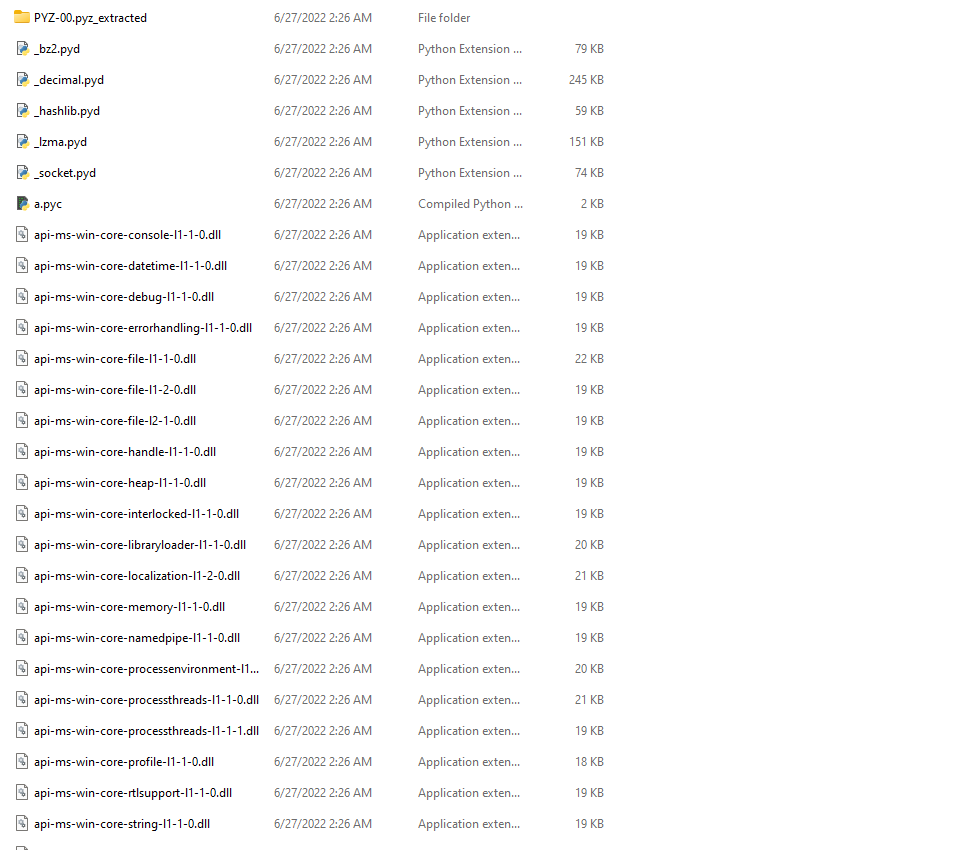
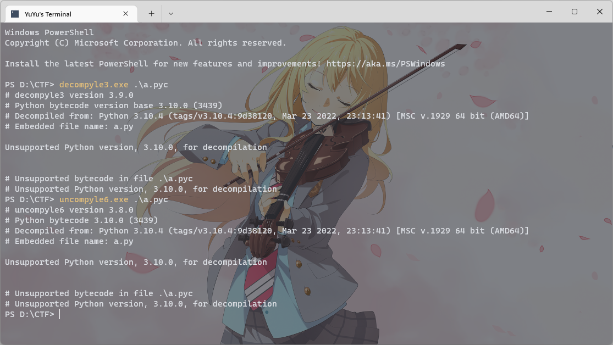

# SUCH AS AN EASY CHALL

Bài này cho một file `a.exe` nhìn icon phát biết ngay compile từ python rồi. Mà nếu compile từ python thì mình sẽ không sử dụng IDA mà sẽ thực hiện như sau:  

1. Extract từ file `a.exe` ra thành các file `pyc`. Tập trung vào file `a.pyc` là file code chính.
2. Sử dụng module `dis` từ python để convert file `pyc` qua `PYTHON BYTECODE`.
3. Convert thủ công từ `bytecode` thành `code python`. (Thực ra là mình có thể dùng tool, có 1 tool tên là `pycdc` nhưng tool này mình test thì lỗi do thiếu 1 vài bytecode mà trong file của đề cho).


## Extract file `a.exe`

Mình sử dụng `pyinstxtractor` để extract

```
git clone https://github.com/extremecoders-re/pyinstxtractor.git pyex

mv pyex/pyinstxtractor.py .

python pyinstxtractor.py a.exe
```

Và kết quả mình được một folder như sau:




Mình chỉ quan tâm đến file a.pyc, lúc này mình sẽ thử dùng những tool mà mình biết để decompile thử đều nhận kết quả là:



Vậy nên mình quyết định sẽ giải tay, sử dụng `dis.dis()` trong python sẽ trả về bytecode của module mà chúng ta truyền vào.

Ở đây mình sử dụng đoạn code sau để đọc `a.pyc` sau đó dịch bytecode:
```Python
import dis
import marshal

with open('a.pyc', 'rb') as f:
    f.seek(16)
    dis.dis(marshal.load(f))
```

Và dưới đây là kết quả:

```
  1           0 LOAD_CONST               0 (0)
              2 LOAD_CONST               1 (None)
              4 IMPORT_NAME              0 (sys)
              6 STORE_NAME               0 (sys)

  3           8 LOAD_CONST               2 ('')
             10 STORE_NAME               1 (flag)

  4          12 SETUP_FINALLY           29 (to 72)

  5          14 LOAD_NAME                2 (open)
             16 LOAD_CONST               3 ('libgcc_s_dw2-1')
             18 LOAD_CONST               4 ('rb')
             20 CALL_FUNCTION            2
             22 SETUP_WITH              14 (to 52)
             24 STORE_NAME               3 (f)

  6          26 LOAD_NAME                3 (f)
             28 LOAD_METHOD              4 (read)
             30 CALL_METHOD              0
             32 LOAD_METHOD              5 (decode)
             34 CALL_METHOD              0
             36 STORE_NAME               1 (flag)
             38 POP_BLOCK

  5          40 LOAD_CONST               1 (None)
             42 DUP_TOP
             44 DUP_TOP
             46 CALL_FUNCTION            3
             48 POP_TOP
             50 JUMP_FORWARD             8 (to 68)
        >>   52 WITH_EXCEPT_START
             54 POP_JUMP_IF_TRUE        29 (to 58)
             56 RERAISE                  1
        >>   58 POP_TOP
             60 POP_TOP
             62 POP_TOP
             64 POP_EXCEPT
             66 POP_TOP
        >>   68 POP_BLOCK
             70 JUMP_FORWARD             8 (to 88)

  7     >>   72 POP_TOP
             74 POP_TOP
             76 POP_TOP

  8          78 LOAD_NAME                0 (sys)
             80 LOAD_METHOD              6 (exit)
             82 CALL_METHOD              0
             84 POP_TOP
             86 POP_EXCEPT

 11     >>   88 LOAD_NAME                1 (flag)
             90 LOAD_CONST               0 (0)
             92 LOAD_CONST               5 (8)
             94 BUILD_SLICE              2
             96 BINARY_SUBSCR
             98 STORE_NAME               7 (part1)

 12         100 LOAD_NAME                1 (flag)
            102 LOAD_CONST               5 (8)
            104 LOAD_CONST               6 (16)
            106 BUILD_SLICE              2
            108 BINARY_SUBSCR
            110 STORE_NAME               8 (part2)

 13         112 LOAD_NAME                1 (flag)
            114 LOAD_CONST               6 (16)
            116 LOAD_CONST               7 (24)
            118 BUILD_SLICE              2
            120 BINARY_SUBSCR
            122 STORE_NAME               9 (part3)

 14         124 LOAD_NAME                1 (flag)
            126 LOAD_CONST               7 (24)
            128 LOAD_CONST               8 (32)
            130 BUILD_SLICE              2
            132 BINARY_SUBSCR
            134 STORE_NAME              10 (part4)

 15         136 LOAD_NAME                1 (flag)
            138 LOAD_CONST               8 (32)
            140 LOAD_CONST               9 (40)
            142 BUILD_SLICE              2
            144 BINARY_SUBSCR
            146 STORE_NAME              11 (part5)

 16         148 LOAD_NAME                1 (flag)
            150 LOAD_CONST               9 (40)
            152 LOAD_CONST              10 (48)
            154 BUILD_SLICE              2
            156 BINARY_SUBSCR
            158 STORE_NAME              12 (part6)

 18         160 BUILD_LIST               0
            162 LOAD_CONST              11 ((175, 190, 187, 208, 127, 201, 148, 222))
            164 LIST_EXTEND              1
            166 STORE_NAME              13 (check12)

 19         168 BUILD_LIST               0
            170 LOAD_CONST              12 ((200, 209, 207, 175, 163, 212, 144, 164))
            172 LIST_EXTEND              1
            174 STORE_NAME              14 (check23)

 20         176 BUILD_LIST               0
            178 LOAD_CONST              13 ((210, 194, 156, 147, 206, 157, 211, 144))
            180 LIST_EXTEND              1
            182 STORE_NAME              15 (check34)

 21         184 BUILD_LIST               0
            186 LOAD_CONST              14 ((231, 143, 100, 190, 149, 101, 231, 216))
            188 LIST_EXTEND              1
            190 STORE_NAME              16 (check45)

 22         192 BUILD_LIST               0
            194 LOAD_CONST              15 ((211, 162, 97, 198, 155, 107, 178, 246))
            196 LIST_EXTEND              1
            198 STORE_NAME              17 (check56)

 25         200 LOAD_NAME               18 (range)
            202 LOAD_CONST               0 (0)
            204 LOAD_CONST               5 (8)
            206 CALL_FUNCTION            2
            208 GET_ITER
        >>  210 FOR_ITER                22 (to 256)
            212 STORE_NAME              19 (i)

 26         214 LOAD_NAME               20 (ord)
            216 LOAD_NAME                7 (part1)
            218 LOAD_NAME               19 (i)
            220 BINARY_SUBSCR
            222 CALL_FUNCTION            1
            224 LOAD_NAME               20 (ord)
            226 LOAD_NAME                8 (part2)
            228 LOAD_NAME               19 (i)
            230 BINARY_SUBSCR
            232 CALL_FUNCTION            1
            234 BINARY_ADD
            236 LOAD_NAME               13 (check12)
            238 LOAD_NAME               19 (i)
            240 BINARY_SUBSCR
            242 COMPARE_OP               3 (!=)
            244 POP_JUMP_IF_FALSE      127 (to 254)

 27         246 LOAD_NAME                0 (sys)
            248 LOAD_METHOD              6 (exit)
            250 CALL_METHOD              0
            252 POP_TOP
        >>  254 JUMP_ABSOLUTE          105 (to 210)

 29     >>  256 LOAD_NAME               18 (range)
            258 LOAD_CONST               0 (0)
            260 LOAD_CONST               5 (8)
            262 CALL_FUNCTION            2
            264 GET_ITER
        >>  266 FOR_ITER                22 (to 312)
            268 STORE_NAME              19 (i)

 30         270 LOAD_NAME               20 (ord)
            272 LOAD_NAME                8 (part2)
            274 LOAD_NAME               19 (i)
            276 BINARY_SUBSCR
            278 CALL_FUNCTION            1
            280 LOAD_NAME               20 (ord)
            282 LOAD_NAME                9 (part3)
            284 LOAD_NAME               19 (i)
            286 BINARY_SUBSCR
            288 CALL_FUNCTION            1
            290 BINARY_ADD
            292 LOAD_NAME               14 (check23)
            294 LOAD_NAME               19 (i)
            296 BINARY_SUBSCR
            298 COMPARE_OP               3 (!=)
            300 POP_JUMP_IF_FALSE      155 (to 310)

 31         302 LOAD_NAME                0 (sys)
            304 LOAD_METHOD              6 (exit)
            306 CALL_METHOD              0
            308 POP_TOP
        >>  310 JUMP_ABSOLUTE          133 (to 266)

 33     >>  312 LOAD_NAME               18 (range)
            314 LOAD_CONST               0 (0)
            316 LOAD_CONST               5 (8)
            318 CALL_FUNCTION            2
            320 GET_ITER
        >>  322 FOR_ITER                22 (to 368)
            324 STORE_NAME              19 (i)

 34         326 LOAD_NAME               20 (ord)
            328 LOAD_NAME                9 (part3)
            330 LOAD_NAME               19 (i)
            332 BINARY_SUBSCR
            334 CALL_FUNCTION            1
            336 LOAD_NAME               20 (ord)
            338 LOAD_NAME               10 (part4)
            340 LOAD_NAME               19 (i)
            342 BINARY_SUBSCR
            344 CALL_FUNCTION            1
            346 BINARY_ADD
            348 LOAD_NAME               15 (check34)
            350 LOAD_NAME               19 (i)
            352 BINARY_SUBSCR
            354 COMPARE_OP               3 (!=)
            356 POP_JUMP_IF_FALSE      183 (to 366)

 35         358 LOAD_NAME                0 (sys)
            360 LOAD_METHOD              6 (exit)
            362 CALL_METHOD              0
            364 POP_TOP
        >>  366 JUMP_ABSOLUTE          161 (to 322)

 37     >>  368 LOAD_NAME               18 (range)
            370 LOAD_CONST               0 (0)
            372 LOAD_CONST               5 (8)
            374 CALL_FUNCTION            2
            376 GET_ITER
        >>  378 FOR_ITER                22 (to 424)
            380 STORE_NAME              19 (i)

 38         382 LOAD_NAME               20 (ord)
            384 LOAD_NAME               10 (part4)
            386 LOAD_NAME               19 (i)
            388 BINARY_SUBSCR
            390 CALL_FUNCTION            1
            392 LOAD_NAME               20 (ord)
            394 LOAD_NAME               11 (part5)
            396 LOAD_NAME               19 (i)
            398 BINARY_SUBSCR
            400 CALL_FUNCTION            1
            402 BINARY_ADD
            404 LOAD_NAME               16 (check45)
            406 LOAD_NAME               19 (i)
            408 BINARY_SUBSCR
            410 COMPARE_OP               3 (!=)
            412 POP_JUMP_IF_FALSE      211 (to 422)

 39         414 LOAD_NAME                0 (sys)
            416 LOAD_METHOD              6 (exit)
            418 CALL_METHOD              0
            420 POP_TOP
        >>  422 JUMP_ABSOLUTE          189 (to 378)

 41     >>  424 LOAD_NAME               18 (range)
            426 LOAD_CONST               0 (0)
            428 LOAD_CONST               5 (8)
            430 CALL_FUNCTION            2
            432 GET_ITER
        >>  434 FOR_ITER                22 (to 480)
            436 STORE_NAME              19 (i)

 42         438 LOAD_NAME               20 (ord)
            440 LOAD_NAME               11 (part5)
            442 LOAD_NAME               19 (i)
            444 BINARY_SUBSCR
            446 CALL_FUNCTION            1
            448 LOAD_NAME               20 (ord)
            450 LOAD_NAME               12 (part6)
            452 LOAD_NAME               19 (i)
            454 BINARY_SUBSCR
            456 CALL_FUNCTION            1
            458 BINARY_ADD
            460 LOAD_NAME               17 (check56)
            462 LOAD_NAME               19 (i)
            464 BINARY_SUBSCR
            466 COMPARE_OP               3 (!=)
            468 POP_JUMP_IF_FALSE      239 (to 478)

 43         470 LOAD_NAME                0 (sys)
            472 LOAD_METHOD              6 (exit)
            474 CALL_METHOD              0
            476 POP_TOP
        >>  478 JUMP_ABSOLUTE          217 (to 434)

 45     >>  480 LOAD_NAME               21 (print)
            482 LOAD_CONST              16 ('C')
            484 CALL_FUNCTION            1
            486 POP_TOP
            488 LOAD_CONST               1 (None)
            490 RETURN_VALUE
```

Sau một hồi tra docs và phán đoán thì mình dịch được ra ý chính của đoạn code trên là như sau:

```Python
import sys

flag = ''

with open('libgcc_s_dw2-1', 'rb') as f:
    flag = f.read().decode()

# có 1 đoạn code ở chỗ này đại loại kiểu gặp exception thì exit

part1 = flag[:8]
part2 = flag[8:16]
part3 = flag[16:24]
part4 = flag[24:32]
part5 = flag[32:40]
part6 = flag[40:48]

check12 = [175, 190, 187, 208, 127, 201, 148, 222]
check23 = [200, 209, 207, 175, 163, 212, 144, 164]
check34 = [210, 194, 156, 147, 206, 157, 211, 144]
check45 = [231, 143, 100, 190, 149, 101, 231, 216]
check56 = [211, 162, 97, 198, 155, 107, 178, 246]

for i in range(8):
    if ord(part1[i]) + ord(part2[i]) != check12[i]:
        sys.exit(1)

for i in range(8):
    if ord(part2[i]) + ord(part3[i]) != check23[i]:
        sys.exit(1)

for i in range(8):
    if ord(part3[i]) + ord(part4[i]) != check34[i]:
        sys.exit(1)

for i in range(8):
    if ord(part4[i]) + ord(part5[i]) != check45[i]:
        sys.exit(1)

for i in range(8):
    if ord(part5[i]) + ord(part6[i]) != check56[i]:
        sys.exit(1)

print("C")
```

Giờ đọc qua code thì mình thấy ý tưởng giải ở đây là sử dụng các check để tính được ra flag, do `check12` cần `part1` và `part2`, `check23` cần `part2` và `part3`. Và hàm để tạo nên check từ 2 part là tuyến tính nên có thể dễ dàng tính ngược về được.

Nhưng giải toán mất thời gian, mình do biết được đầu của flag là `'FPTUHack'` vậy nên mình sẽ dùng 8 kí tự trước để tính được ra 8 kí tự sau.

```Python
check = [175, 190, 187, 208, 127, 201, 148, 222, 200, 209, 207, 175, 163, 212, 144, 164, 210, 194, 156, 147, 206, 157, 211, 144, 231, 143, 100, 190, 149, 101, 231, 216, 211, 162, 97, 198, 155, 107, 178, 246]

flag = "FPTUHack"

print(flag, end='')
while len(check) > 0:
    c = chr(check[0] - ord(flag[-8]))
    flag += c
    print(c, end='')
    check = check[1:]
```

Kết quả: `FPTUHacking{7h1s_ch4ll_1s_4_b1t_t00_34sy_r1gh7?}`