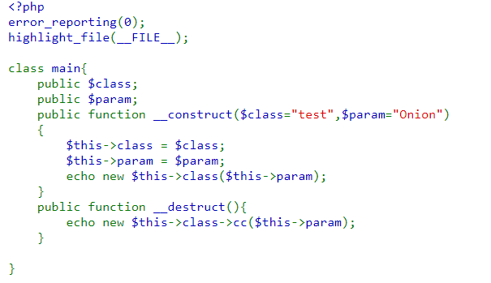
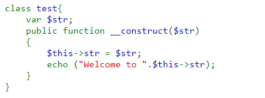
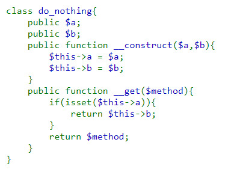
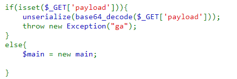
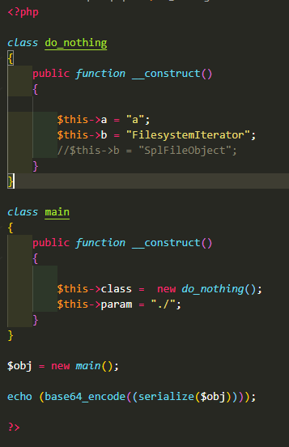
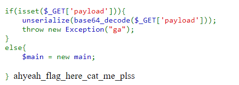
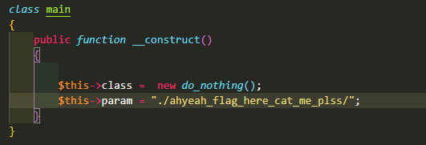
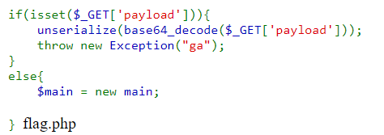
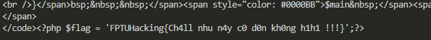

# Có giòn không?

- [Link Challenge](http://103.245.249.76:49167/)
- [Link Source code](source.php)

## Cái nhìn đầu tiên:
- Đây tiếp tục là một challenge về PHP, và may mắn, đã cho source để mình có thể dựng ở localhost và exploit. Nghe nói challenge này, idol TaiDH chỉ viết trong 15p, mà khiến mình phải thở oxi cả tối mới ra :D . 
- Đây là một challenge về PHP Object Injection, cụ thể là tấn công vào hàm unserialize() khi không filter user input. Các bạn có thể đọc thêm về cơ bản của lỗi này tại [đây](https://owasp.org/www-community/vulnerabilities/PHP_Object_Injection) hoặc [đây](https://portswigger.net/web-security/deserialization/exploiting) 

## Quá trình giải:

>### Phần 1: Hiểu code nó viết gì...
Tổng quan, source code có 3 class: main, test, do_nothing và 1 phần để xử lý payload, cụ thể là deserialize cái payload mình gửi đi, đồng thời bảo người chơi là `"ga"` :))

Đây là class `main`. Class có 2 attribute là `$class` và `$param`. Khi gọi hàm khởi tạo (`__construct`) thì `$class` được gán mặc định với giá trị `"test"` và `$param` được gán với giá trị `"Onion"`. Class còn có 1 magic method là `__destruct()`, sẽ in ra output của function `cc()` của class `$class` có parameter là `$this->param`.

Cuối cùng, sẽ tạo 1 đối tượng của class có tên `$class` và truyền vào hàm khởi tạo của class đó 1 parameter là `$param`. Với trường hợp mặc định, sẽ là class `test` và attribute `Onion`. Tại class `test`, hàm khởi tạo lại nhận một parameter là `$str`, gán nó cho attribute `$str` rồi in ra string `"Welcome to" + $str`. 

Class thứ 3, `do_nothing`  có 2 attribute là `$a` và `$b`, hàm khởi tạo, và 1 magic method `__get` nhận parameter `$method`.  

Cuối cùng là phần code xử lý payload, chỉ đơn giản là lấy giá trị của GET parameter `payload` rồi decode bằng base64 rồi chạy hàm unserialize. Đây là nơi exploit trọng tâm.

>### Phần 2: Bắt đầu cảm thấy bài này không thể giải được...

- Ý tưởng ban đầu của mình là xây dựng 1 gadnet chain riêng cho bài này. Mình có viết một file [exploit.php](exploit.php) để dễ lấy payload hơn.
- Mình sẽ tạo 1 đối tượng của class `main`, truyền các attribute vào, lúc này, khi deserialize thì method `__construct()` sẽ được chạy, đồng thời đặt lại giá trị của các attribute. Điều này lại dẫn tới việc gọi method `__destruct()` của class `main`, gọi tới hàm `cc()` của 1 class nào đó. Ở đây mình chọn class `do_nothing`. Hàm `cc()` không tồn tại trong source code, nên khi gọi tới hàm đó, method `__get()` sẽ được gọi tới (tồn tại trong class do_nothing, lý do mà mình chọn `do_nothing` chứ không phải `test`). Tới đây mình bắt đầu stuck... 
- Thông thường, các bài PHP deserialize cơ bản chỉ nhận string để exploit thường đều cho 1 function nằm trong nhóm các [dangerous function](https://gist.github.com/snoopysecurity/7afd189724bc02a14a7f89d9a8284b69) . Tuy nhiên, với bài này thì không, vậy nên, ban đầu, sau khi hiểu flow exploit, mình cảm thấy không giòn tí nào :D.

>### Phần 3: À...

- Stuck, mình bắt đầu lang thang trên mạng và bước ngoặt xảy ra ở việc, mình tìm thấy bài viết [này](https://chowdera.com/2022/04/202204011055329217.html). Khi không thể sử dụng các class có trong source code, thì bắt buộc phải sử dụng `"Native classes"` của PHP để `"Directory Traversal" và "File Reading"`. Chi tiết thì có thể xem ở link phía trên, ở đây mình đã dùng 2 class `"FilesystemIterator"` và `"SplFileObject"`.

- Bước đầu tiên, mình sẽ khởi tạo đối tượng của class `main` với attribute `class` = `new do_nothing()` và `param` = `"./"` để đọc các file có trong thư mục hiện tại. Tại class `do_nothing`, mình gán `a` bằng 1 giá trị bất kì, chỉ để thỏa mãn điều kiện `if(isset($this->a))` và với `b` là tên class `"FilesystemIterator"`.

- Chạy [script.py](script.py), mình nhận được thứ đang tìm kiếm, đó là tên 1 file/folder trông rất mlem `"ahyeah_flag_here_cat_me_plss"`. Ban đầu, mình nghĩ đó là file, tuy nhiên, sau khi thử đọc content của nó không thành công, mình chuyển hướng sang đây là 1 folder, và đã đúng.

- Thay đổi `param` của `main` 1 chút thành `"./ahyeah_flag_here_cat_me_plss/"` mình nhận được thứ mlem thứ 2 :3
   

- Thay đổi `b` ở `do_nothing` thành `"SplFileObject"` và `param` của `main` 1 chút thành `"./ahyeah_flag_here_cat_me_plss/flag.php"` để đọc nội dung của file `flag.php`
 
- Ở đây, mình mắc 1 sai lầm, đó là gửi payload ngay trên trình duyệt, vì flag nằm trong 1 đoạn script php, nên trình duyệt mặc định đấy là 1 thẻ php và không render, làm mình tưởng payload có vấn đề :D. Tuy nhiên, khi chạy bằng script.py, hoặc đơn giản là ctrl+U, mình đã thấy thứ mà ai cũng muốn thấy.

## Payload và Flag:
- Payload: `http://103.245.249.76:49167/?payload=Tzo0OiJtYWluIjoyOntzOjU6ImNsYXNzIjtPOjEwOiJkb19ub3RoaW5nIjoyOntzOjE6ImEiO3M6MToiYSI7czoxOiJiIjtzOjEzOiJTcGxGaWxlT2JqZWN0Ijt9czo1OiJwYXJhbSI7czozOToiLi9haHllYWhfZmxhZ19oZXJlX2NhdF9tZV9wbHNzL2ZsYWcucGhwIjt9`
- Flag: `FPTUHacking{Ch4ll nhu n4y c0 d0n kh0ng h1h1 !!!}`

