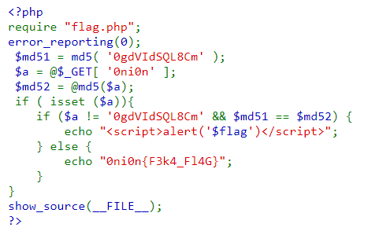

# PHP is easy
- [Link Challenge](http://103.245.249.76:49154/)
- Như tên gọi, đây là một challenge về PHP. Cụ thể, challenge khai thác về [PHP Loose Comparison](https://owasp.org/www-pdf-archive/PHPMagicTricks-TypeJuggling.pdf) và [Magic Hash aka PHP hash "collisions"](https://github.com/spaze/hashes).

Dưới đây là source của bài:

## Phân tích:

- Như đã viết phía trên, đây là một challenge về một vul khá cơ bản của PHP.
- Phía Backend sẽ lấy giá trị của GET Parameter "0ni0n", gán giá trị cho biến $a. Sau đó, dùng hàm tính hash md5 của $a gán vào $md52.
- Tiếp đến, nếu tồn tại $a thì sẽ alert flag với điều kiện: 
  
  `$a != "0gdVISQL8Cm"` và `$md52 == $md51`
- Hai điều kiện thoạt nhìn có vẻ vô lý, nhưng sau khi kiểm tra hash md5 của `0gdVISQL8Cm` : `0e366928091944678781059722345471` 
- Ta sẽ lấy $a = `"suerFfjLQRmk"` có hash là `0e060125509800398574391675067075`. Khi so sánh `==` (loose) thì 2 hash sẽ bằng nhau => thỏa mãn điều kiện

## Payload và flag:

Payload: `http://103.245.249.76:49154/?0ni0n=suerFfjLQRmk`

Flag:  `FPTUHACKING{Md5_bY_pAAs_eZ_H4_H4}`

