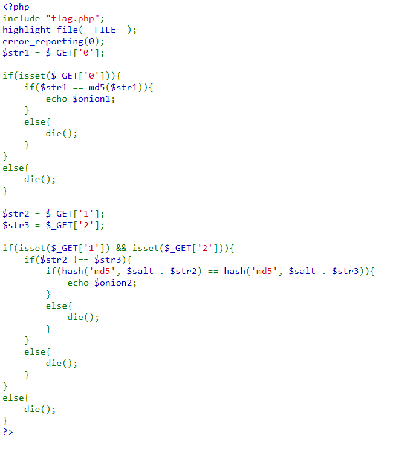

# Piece Of Cake
- [Link Challenge](http://103.245.249.76:49155/)
- Tương tự bài PHP is easy, đây cũng là một challenge về PHP, khai thác đồng thời PHP Loose Comparison và Magic Hash, nhưng ở một mức độ khó hơn (một chút :>)

Dưới đây là source của bài: 

## Phân tích:

- Mình làm bài này sau khi làm xong [PHP is easy](../PHP_is_easy/README.md), nên việc đoán vul và hình thành payload khá đơn giản.
- Bài yêu cầu 3 GET Parameter, lần lượt là `0`, `1`, `2`. 
  + Với `$_GET['0']` thì so sánh `==` với hash md5 của chính nó. Mình tìm được cặp `0e215962017` và `0e291242476940776845150308577824` nhập đúng thì sẽ nhận được phần đầu của flag là `FPTUHACKING{StR1Ngs_`
  + Với `$_GET['1']` và `$_GET['2']` thì ban đầu, mình thấy có 1 biến `$salt` concat ngay phía trước các biến `$str2` và `$str3` nên mình chỉ thử một cách vô tình với payload `"http://103.245.249.76:49155/?0=0e215962017&1=abczVBJSUuR&2=abczJQsLLMR"` thì nhận luôn phần còn lại của flag(`"abczVBJSUuR"` và `"abczJQsLLMR"` là 2 chuỗi có hash md5 bằng nhau với loose compare). Mình đoán là biến $salt không tồn tại, nên khi concat thì vẫn giữ giá trị cũ. Có vẻ chỉ cần 2 string có hash md5 bị vul loose compare là được 

## Payload và flag:
Payload: `http://103.245.249.76:49155/?0=0e215962017&1=abczVBJSUuR&2=abczJQsLLMR`

Flag: `FPTUHACKING{StR1Ngs_c0nCaTeNaT1oN_1s_EaSy_!!!}`