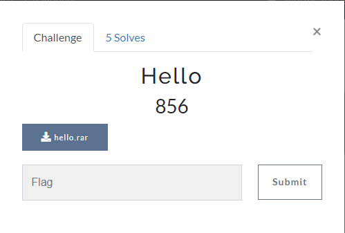

# Hello

## Đề bài


File: [hello](./hello.rar)

## Writeup

Chúng ta có file binary hello.exe, khi chạy sẽ yêu cầu mình nhập một chuỗi, nếu đó là FLAG thì sẽ in ra `:)`, ngược lại in ra `:(`

Theo thói quen, mình thả vào IDA xem thử, và thấy hàm `main` như sau:
```C
int __cdecl main(int argc, const char **argv, const char **envp)
{
  bool check_result; // bl
  std::ostream *_cout; // rax
  char flag[16]; // [rsp+20h] [rbp-60h] BYREF
  char string_flag[32]; // [rsp+30h] [rbp-50h] BYREF

  _main();
  std::string::string((std::string *)flag);

  // std::cout << "FLAG: "
  std::operator<<<std::char_traits<char>>(refptr__ZSt4cout, "FLAG: ");

  // std::cin >> flag
  std::operator>><char>(refptr__ZSt3cin, (std::string *)flag);

  // std::string string_flag = std::string(flag)
  std::string::string((std::string *)string_flag, (const std::string *)flag);

  check_result = (unsigned int)check(string_flag) == 0;

  // destructor of string_flag
  std::string::~string((std::string *)string_flag);

  if ( check_result )
    _cout = (std::ostream *)std::operator<<<std::char_traits<char>>(refptr__ZSt4cout, ":("); // print :)
  else
    _cout = (std::ostream *)std::operator<<<std::char_traits<char>>(refptr__ZSt4cout, ":)"); // print :(

  refptr__ZSt4endlIcSt11char_traitsIcEERSt13basic_ostreamIT_T0_ES6_(_cout);
  std::string::~string((std::string *)flag);
  return 0;
}
```

Những thao tác xử lý ở đây trông có vẻ rất bình thường, nên mục tiêu mình quan tâm ở đây sẽ là hàm `check`:
```C
__int64 __fastcall check(std::string *flag)
{
  _BYTE *c; // rax
  unsigned __int64 _i; // rbx
  _BYTE buffer[644]; // [rsp+0h] [rbp-80h] BYREF
  int i; // [rsp+284h] [rbp+204h]
  int correct_time; // [rsp+288h] [rbp+208h]
  unsigned int failed_result; // [rsp+28Ch] [rbp+20Ch]

  // copy flag đã mã hóa vào buffer + 32
  qmemcpy(&buffer[32], &DATA, 284ui64);

  failed_result = 0;
  correct_time = 0;
  for ( i = 0; ; ++i )
  {
    _i = i;

    // nếu quá flag.length() thì thoát
    if ( _i >= std::string::length(flag) )
      break;
    
    // lấy kí tự thứ i của flag
    c = (_BYTE *)std::string::operator[](flag, i);

    // mã hóa từng kí tự sau đó so sánh với flag đã mã hóa nếu trùng thì tăng correct_time 
    *(_DWORD *)&buffer[4 * i + 320] = 4919 * ((char)(*c ^ 0x19) + 145) % 255;

    if ( *(_DWORD *)&buffer[4 * i + 320] == *(_DWORD *)&buffer[4 * i + 32] )
      ++correct_time;
  }

  // nếu số kí tự correct chính xác là 71 thì trả về 1
  if ( correct_time == 71 )
    return 1;
  return failed_result;
}
```

Vậy là mình đã clear được cách chương trình này hoạt động, bây giờ mình sẽ sử dụng data flag đã mã hóa để brute force flag.

Dưới đây là script mình code trong C++:
```C++
#include <iostream>

unsigned char ida_chars[] =
{
  0xA5, 0x00, 0x00, 0x00, 0x22, 0x00, 0x00, 0x00, 0x8D, 0x00,
  0x00, 0x00, 0x10, 0x00, 0x00, 0x00, 0x7B, 0x00, 0x00, 0x00,
  0x84, 0x00, 0x00, 0x00, 0x44, 0x00, 0x00, 0x00, 0x10, 0x00,
  0x00, 0x00, 0xB7, 0x00, 0x00, 0x00, 0xA7, 0x00, 0x00, 0x00,
  0x5A, 0x00, 0x00, 0x00, 0xE6, 0x00, 0x00, 0x00, 0xD8, 0x00,
  0x00, 0x00, 0x5D, 0x00, 0x00, 0x00, 0x5A, 0x00, 0x00, 0x00,
  0xD8, 0x00, 0x00, 0x00, 0x6D, 0x00, 0x00, 0x00, 0xF9, 0x00,
  0x00, 0x00, 0xEE, 0x00, 0x00, 0x00, 0x23, 0x00, 0x00, 0x00,
  0x6D, 0x00, 0x00, 0x00, 0x6D, 0x00, 0x00, 0x00, 0x5D, 0x00,
  0x00, 0x00, 0x8E, 0x00, 0x00, 0x00, 0xB7, 0x00, 0x00, 0x00,
  0xC5, 0x00, 0x00, 0x00, 0x44, 0x00, 0x00, 0x00, 0x5A, 0x00,
  0x00, 0x00, 0x44, 0x00, 0x00, 0x00, 0xA7, 0x00, 0x00, 0x00,
  0x10, 0x00, 0x00, 0x00, 0xAF, 0x00, 0x00, 0x00, 0xEE, 0x00,
  0x00, 0x00, 0x23, 0x00, 0x00, 0x00, 0xC5, 0x00, 0x00, 0x00,
  0xC5, 0x00, 0x00, 0x00, 0xC5, 0x00, 0x00, 0x00, 0xC5, 0x00,
  0x00, 0x00, 0xB7, 0x00, 0x00, 0x00, 0xEE, 0x00, 0x00, 0x00,
  0xEE, 0x00, 0x00, 0x00, 0xF9, 0x00, 0x00, 0x00, 0xD8, 0x00,
  0x00, 0x00, 0x5A, 0x00, 0x00, 0x00, 0x44, 0x00, 0x00, 0x00,
  0xB7, 0x00, 0x00, 0x00, 0xD8, 0x00, 0x00, 0x00, 0xE6, 0x00,
  0x00, 0x00, 0xD8, 0x00, 0x00, 0x00, 0xE6, 0x00, 0x00, 0x00,
  0xC5, 0x00, 0x00, 0x00, 0x23, 0x00, 0x00, 0x00, 0x5D, 0x00,
  0x00, 0x00, 0xF9, 0x00, 0x00, 0x00, 0x5D, 0x00, 0x00, 0x00,
  0xE6, 0x00, 0x00, 0x00, 0x5A, 0x00, 0x00, 0x00, 0xEE, 0x00,
  0x00, 0x00, 0x10, 0x00, 0x00, 0x00, 0xD8, 0x00, 0x00, 0x00,
  0xAF, 0x00, 0x00, 0x00, 0x6D, 0x00, 0x00, 0x00, 0x44, 0x00,
  0x00, 0x00, 0xF9, 0x00, 0x00, 0x00, 0x5D, 0x00, 0x00, 0x00,
  0x8E, 0x00, 0x00, 0x00, 0x44, 0x00, 0x00, 0x00, 0x44, 0x00,
  0x00, 0x00, 0xA7, 0x00, 0x00, 0x00, 0x5D, 0x00, 0x00, 0x00,
  0x19, 0x00, 0x00, 0x00
};

int main() {
	for (size_t i = 0; i < sizeof(ida_chars); i += 4)
	{
		for (char c = 32; c < 128; c++)
			if ((4919 * ((char)(c ^ 0x19) + 145)) % 255 == ida_chars[i])
			{
				std::cout << c;
				break;
			}
	}

	return 0;
}
```

FLAG: `FUSec{3e68da59d570f477926b3d38e1f4bbbb6ff05d365a5ab4909adfe51730923389}`
