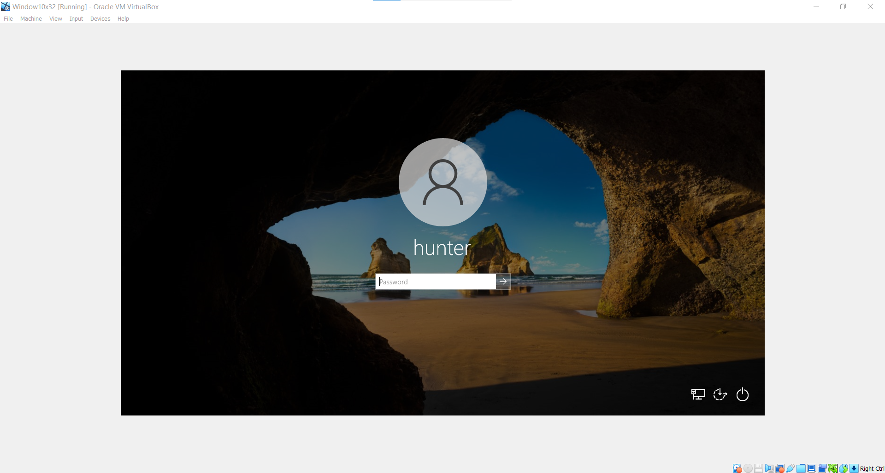
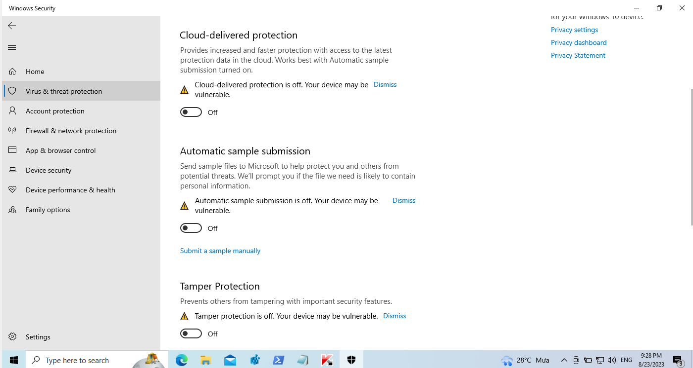
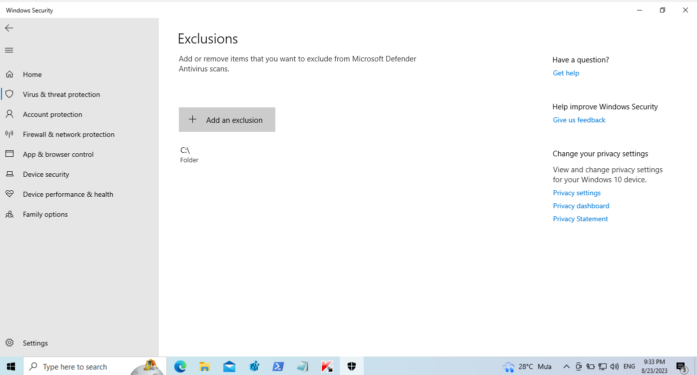

# MISC 01

Đề bài cho 1 file ova **Window10x32.ova** & tìm ra file mã độc   
-> Import bằng Virtual Box  
Sau khi đã login vào thì ngay lập tức một đống chương trình đã xổ ra  
Tuy nhiên thì trong đống này không có cái nào có thể giúp tìm ra file mã độc cả, tuy nhiên có thể xóa đi để bớt khó chịu bằng cách sử dụng Task Manager -> tab Startup -> disable chương trình  
Vì đề bài yêu cầu tìm ra file mã độc nên việc đầu tiên mình nghĩ đến là dùng các công cụ trong bộ Sysinternal để check Virustotal giúp đẩy nhanh quá trình tìm kiếm. Trong trường hợp này mình sử dụng 2 công cụ là Process Explorer và Autoruns phiên bản dành cho hệ điều hành 32 bits 

Mình tìm ra được 1 vài phần mềm đã bị report đỏ bởi Virustotal, tuy nhiên thì đây không phải mã độc mà đề bài muốn nhắc tới 
Tiếp tục với việc đáp 1 đống tool để scan virus, tool mình sử dụng là TDSSKiller(scan rootkit) và KVRT(scan virus) của Kaspersky 
Và mình đã tìm ra được file scvhost.exe 
Dùng md5 hash search trên Virustotal thì kết quả là 9 api đã detect được đây là malware -> submit flag:  
**FUSec{scvhost.exe}**
## Another solution
Khi mình kiểm tra Defender của Windows thì thấy tất cả các option đã bị tắt hết 
Lúc này mình nghĩ rằng đây tác giả đã cố tình tắt đi để không report malware ngay lập tức khi Windows tự scan 
Tiếp tuc check phần exclusion của defender thì mình thấy toàn bộ ổ C đã bị exclude
-> Bật toàn bộ chức năng của Windows Defender và xóa Exclusion đi và bắt đầu Scan bằng Defender
