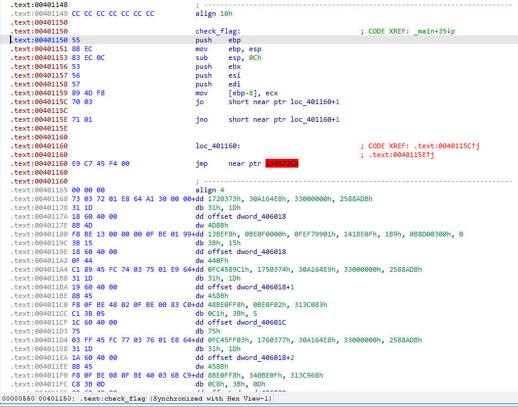
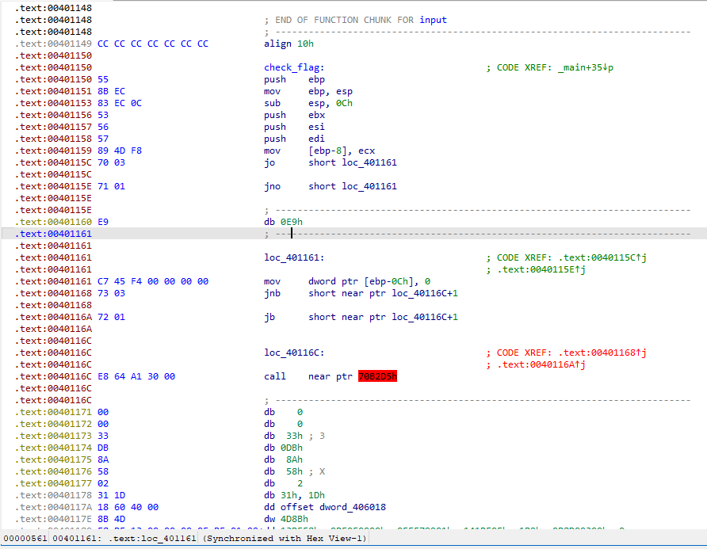

# RE01

Sau khi nhận được file thì mình vứt luôn vào IDA. Nội dung hàm main sau khi mình phân tích các subroutine trong đó:

```C++
int __cdecl main(int argc, const char **argv, const char **envp)
{
  const char *flag; // esi
  int v4; // ecx
  const char *v5; // edx
  int v6; // eax
  int v7; // eax
  int v8; // eax

  flag = (const char *)new_operator(0x32u);
  call_std(std::cout, "FLAG: ");
  input(flag);
  if ( ((int (__thiscall *)(const char *))check_flag)(flag) )
  {
    v6 = call_std(std::cout, "You are correct, your flag is FUSec{");
    v7 = call_std(v6, flag);
    v5 = "}";
    v4 = v7;
  }
  else
  {
    v4 = std::cout;
    v5 = "Fail.";
  }
  v8 = call_std(v4, v5);
  std::ostream::operator<<(v8);
  return 0;
}
```

Thứ mình cần focus vào lúc này là hàm ```check_flag```:



Mình thấy ở đoạn `0x00401160` interupt IDA Disassembly. Vậy là mình đoán ở đây sử dụng kỹ thuật Anti-Disassembly, nên mình thử Undefine dòng đó, sau đó skip thử 1 byte để convert thành code và kết quả là:



Quá chuẩn luôn! Giờ mình chỉ việc nop byte thừa kia ra để IDA có thể dissambly toàn bộ hàm này, nên viết 1 script ida_python để thực hiện thay vì làm thủ công (mình thì lúc đó nghĩ là cũng không nhiều lắm đâu nên làm thủ công 54 cái điều kiện :'<)

Thao tác thủ công trên IDA sẽ là:
- Click U để Undefine dòng đó
- Skip 1 byte và Click C để convert đoạn đó thành code
- Chọn byte thừa và tổ hợp Ctrl + N để đổi byte đó thành 0x90 (NOP)
- Click C một lần nữa để chuyển byte 0x90 kia thành NOP

Sau khi patch hết mớ anti-disassembly, mình click P để convert đoạn này thành sub-routine và F5 để gen pseudo-code

```C++
BOOL __thiscall check_flag(const char *this)
{
  BOOL v1; // eax
  int v3; // [esp+Ch] [ebp-Ch]
  int v4; // [esp+14h] [ebp-4h]

  v3 = 0;
  dword_406018 ^= NtCurrentPeb()->BeingDebugged;
  v1 = this[1] + *this % 19 == dword_406018;
  v4 = v1;
  *(int *)((char *)&dword_406018 + 1) ^= NtCurrentPeb()->BeingDebugged;
  if ( this[2] + *this + 19 == dword_40601C )
    v4 = v1 + 1;
  *(int *)((char *)&dword_406018 + 2) ^= NtCurrentPeb()->BeingDebugged;
  if ( this[3] + 19 * *this == dword_406020 )
    ++v4;
  *(int *)((char *)&dword_406018 + 3) ^= NtCurrentPeb()->BeingDebugged;
  if ( this[5] + this[4] % 20 == dword_406024 )
    ++v4;
  dword_40601C ^= NtCurrentPeb()->BeingDebugged;
  if ( this[4] + this[6] + 20 == dword_406028 )
    ++v4;
  *(int *)((char *)&dword_40601C + 1) ^= NtCurrentPeb()->BeingDebugged;
  if ( this[7] + 20 * this[4] == dword_40602C )
    ++v4;
  *(int *)((char *)&dword_40601C + 2) ^= NtCurrentPeb()->BeingDebugged;
  if ( this[9] + this[8] % 21 == dword_406030 )
    ++v4;
  *(int *)((char *)&dword_40601C + 3) ^= NtCurrentPeb()->BeingDebugged;
  if ( this[8] + this[10] + 21 == dword_406034 )
    ++v4;
  dword_406020 ^= NtCurrentPeb()->BeingDebugged;
  if ( this[11] + 21 * this[8] == dword_406038 )
    ++v4;
  *(int *)((char *)&dword_406020 + 1) ^= NtCurrentPeb()->BeingDebugged;
  if ( this[13] + this[12] % 22 == dword_40603C )
    ++v4;
  *(int *)((char *)&dword_406020 + 2) ^= NtCurrentPeb()->BeingDebugged;
  if ( this[12] + this[14] + 22 == dword_406040 )
    ++v4;
  *(int *)((char *)&dword_406020 + 3) ^= NtCurrentPeb()->BeingDebugged;
  if ( this[15] + 22 * this[12] == dword_406044 )
    ++v4;
  dword_406024 ^= NtCurrentPeb()->BeingDebugged;
  if ( this[17] + this[16] % 23 == dword_406048 )
    ++v4;
  *(int *)((char *)&dword_406024 + 1) ^= NtCurrentPeb()->BeingDebugged;
  if ( this[18] + this[16] + 23 == dword_40604C )
    ++v4;
  *(int *)((char *)&dword_406024 + 2) ^= NtCurrentPeb()->BeingDebugged;
  if ( this[19] + 23 * this[16] == dword_406050 )
    ++v4;
  *(int *)((char *)&dword_406024 + 3) ^= NtCurrentPeb()->BeingDebugged;
  if ( this[21] + this[20] % 24 == dword_406054 )
    ++v4;
  dword_406028 ^= NtCurrentPeb()->BeingDebugged;
  if ( this[20] + this[22] + 24 == dword_406058 )
    ++v4;
  *(int *)((char *)&dword_406028 + 1) ^= NtCurrentPeb()->BeingDebugged;
  if ( this[23] + 24 * this[20] == dword_40605C )
    ++v4;
  *(int *)((char *)&dword_406028 + 2) ^= NtCurrentPeb()->BeingDebugged;
  if ( this[25] + this[24] % 25 == dword_406060 )
    ++v4;
  *(int *)((char *)&dword_406028 + 3) ^= NtCurrentPeb()->BeingDebugged;
  if ( this[24] + this[26] + 25 == dword_406064 )
    ++v4;
  dword_40602C ^= NtCurrentPeb()->BeingDebugged;
  if ( this[27] + 25 * this[24] == dword_406068 )
    ++v4;
  *(int *)((char *)&dword_40602C + 1) ^= NtCurrentPeb()->BeingDebugged;
  if ( this[29] + this[28] % 26 == dword_40606C )
    ++v4;
  *(int *)((char *)&dword_40602C + 2) ^= NtCurrentPeb()->BeingDebugged;
  if ( this[28] + this[30] + 26 == dword_406070 )
    ++v4;
  *(int *)((char *)&dword_40602C + 3) ^= NtCurrentPeb()->BeingDebugged;
  if ( this[31] + 26 * this[28] == dword_406074 )
    ++v4;
  dword_406030 ^= NtCurrentPeb()->BeingDebugged;
  if ( this[33] + this[32] % 27 == dword_406078 )
    ++v4;
  *(int *)((char *)&dword_406030 + 1) ^= NtCurrentPeb()->BeingDebugged;
  if ( this[34] + this[32] + 27 == dword_40607C )
    ++v4;
  *(int *)((char *)&dword_406030 + 2) ^= NtCurrentPeb()->BeingDebugged;
  if ( this[35] + 27 * this[32] == dword_406080 )
    ++v4;
  *(int *)((char *)&dword_406030 + 3) ^= NtCurrentPeb()->BeingDebugged;
  if ( this[37] + this[36] % 28 == dword_406084 )
    ++v4;
  dword_406034 ^= NtCurrentPeb()->BeingDebugged;
  if ( this[36] + this[38] + 28 == dword_406088 )
    ++v4;
  *(int *)((char *)&dword_406034 + 1) ^= NtCurrentPeb()->BeingDebugged;
  if ( this[39] + 28 * this[36] == dword_40608C )
    ++v4;
  *(int *)((char *)&dword_406034 + 2) ^= NtCurrentPeb()->BeingDebugged;
  if ( this[40] + 28 * this[36] == dword_406090 )
    ++v4;
  *(int *)((char *)&dword_406034 + 3) ^= NtCurrentPeb()->BeingDebugged;
  if ( this[43]
     + this[47]
     + this[42]
     + this[46]
     + this[41]
     + this[45]
     + this[44]
     + this[48]
     + (this[33] ^ this[34]) * (this[38] + this[39] + this[36] + this[37] + this[40] + this[35]) == dword_406094 )
    ++v4;
  dword_406038 ^= NtCurrentPeb()->BeingDebugged;
  if ( this[43]
     + this[47]
     + this[42]
     + this[46]
     + this[41]
     + this[45]
     + this[44]
     + this[48]
     + (this[33] ^ this[35] ^ this[34]) * (this[38] + this[39] + this[36] + this[37] + this[40]) == dword_406098 )
    ++v4;
  *(int *)((char *)&dword_406038 + 1) ^= NtCurrentPeb()->BeingDebugged;
  if ( (this[33] + this[34] + this[35]) * (this[39] ^ this[38] ^ this[36] ^ this[40] ^ this[37])
     - this[48]
     - this[44]
     - this[45]
     - this[41]
     - this[46]
     - this[42]
     - this[47]
     - this[43] == dword_40609C )
    ++v4;
  *(int *)((char *)&dword_406038 + 2) ^= NtCurrentPeb()->BeingDebugged;
  if ( this[43]
     + this[47]
     + this[42]
     + this[46]
     + this[41]
     + this[45]
     + this[44]
     + this[48]
     + (this[26] ^ this[25]) * (this[29] + this[32] + this[27] + this[30] + this[31] + this[28]) == dword_4060A0 )
    ++v4;
  *(int *)((char *)&dword_406038 + 3) ^= NtCurrentPeb()->BeingDebugged;
  if ( this[29]
     + this[28]
     + (this[27] ^ this[26] ^ this[25])
     + this[32] * this[30] * this[31]
     - this[48]
     - this[44]
     - this[45]
     - this[41]
     - this[46]
     - this[42]
     - this[47]
     - this[43] == dword_4060A4 )
    ++v4;
  dword_40603C ^= NtCurrentPeb()->BeingDebugged;
  if ( this[26]
     + this[27]
     + this[25]
     + (this[32] ^ this[31] ^ (this[29] * this[30] * this[28]))
     - this[48]
     - this[44]
     - this[45]
     - this[41]
     - this[46]
     - this[42]
     - this[47]
     - this[43] == dword_4060A8 )
    ++v4;
  *(int *)((char *)&dword_40603C + 1) ^= NtCurrentPeb()->BeingDebugged;
  if ( this[17] * this[18] * this[19]
     + (this[23] ^ this[22] ^ this[20] ^ this[24] ^ this[21])
     - this[48]
     - this[44]
     - this[45]
     - this[41]
     - this[46]
     - this[42]
     - this[47]
     - this[43] == dword_4060AC )
    ++v4;
  *(int *)((char *)&dword_40603C + 2) ^= NtCurrentPeb()->BeingDebugged;
  if ( this[43]
     + this[47]
     + this[20]
     + this[42]
     + this[46]
     + this[41]
     + this[45]
     + this[44]
     + this[48]
     + this[17] * this[18] * this[19]
     - this[24]
     - this[21]
     - this[23]
     - this[22] == dword_4060B0 )
    ++v4;
  *(int *)((char *)&dword_40603C + 3) ^= NtCurrentPeb()->BeingDebugged;
  if ( this[22]
     + this[23]
     + this[43]
     + this[47]
     + this[20]
     + this[42]
     + this[46]
     + this[21]
     + this[24]
     + this[41]
     + this[45]
     + this[44]
     + this[48]
     + (this[17] ^ this[19] ^ this[18]) == dword_4060B4 )
    ++v4;
  dword_406040 ^= NtCurrentPeb()->BeingDebugged;
  if ( this[10] * this[11] * this[9]
     + (this[16] ^ this[13] ^ this[15] ^ this[14] ^ this[12])
     - this[48]
     - this[44]
     - this[45]
     - this[41]
     - this[46]
     - this[42]
     - this[47]
     - this[43] == dword_4060B8 )
    ++v4;
  *(int *)((char *)&dword_406040 + 1) ^= NtCurrentPeb()->BeingDebugged;
  if ( (this[10] + this[9]) * (this[16] ^ this[13] ^ this[15] ^ this[14] ^ (this[11] + this[12]))
     - this[48]
     - this[44]
     - this[45]
     - this[41]
     - this[46]
     - this[42]
     - this[47]
     - this[43] == dword_4060BC )
    ++v4;
  *(int *)((char *)&dword_406040 + 2) ^= NtCurrentPeb()->BeingDebugged;
  if ( this[13]
     + this[16]
     + this[43]
     + this[47]
     + this[10]
     + this[42]
     + this[46]
     + this[15]
     + this[41]
     + this[45]
     + this[9]
     + this[12]
     + this[44]
     + this[48]
     - this[14]
     - this[11] == dword_4060C0 )
    ++v4;
  *(int *)((char *)&dword_406040 + 3) ^= NtCurrentPeb()->BeingDebugged;
  if ( this[43]
     + this[47]
     + this[42]
     + this[46]
     + this[2]
     + this[41]
     + this[45]
     + this[44]
     + this[48]
     - (this[7] ^ this[6] ^ this[4] ^ this[8] ^ this[5] ^ this[3])
     - this[1] == dword_4060C4 )
    ++v4;
  dword_406044 ^= NtCurrentPeb()->BeingDebugged;
  if ( this[1]
     + this[6]
     + this[7]
     + this[4]
     + this[5]
     + this[8]
     + this[3]
     + (this[47] ^ this[43] ^ this[46] ^ this[42] ^ this[45] ^ this[41] ^ this[48] ^ this[44])
     - this[2] == dword_4060C8 )
    ++v4;
  *(int *)((char *)&dword_406044 + 1) ^= NtCurrentPeb()->BeingDebugged;
  if ( this[1]
     + this[43]
     + this[47]
     + this[42]
     + this[46]
     + this[41]
     + this[45]
     + this[44]
     + this[48]
     - (this[7] ^ this[6] ^ this[4] ^ this[8] ^ this[5] ^ this[3])
     - this[2] == dword_4060CC )
    ++v4;
  *(int *)((char *)&dword_406044 + 2) ^= NtCurrentPeb()->BeingDebugged;
  if ( this[41] == dword_4060D0 )
    ++v4;
  *(int *)((char *)&dword_406044 + 3) ^= NtCurrentPeb()->BeingDebugged;
  if ( this[42] == dword_4060D4 )
    ++v4;
  dword_406048 ^= NtCurrentPeb()->BeingDebugged;
  if ( this[43] == dword_4060D8 )
    ++v4;
  *(int *)((char *)&dword_406048 + 1) ^= NtCurrentPeb()->BeingDebugged;
  if ( this[44] == dword_4060DC )
    ++v4;
  *(int *)((char *)&dword_406048 + 2) ^= NtCurrentPeb()->BeingDebugged;
  if ( this[45] == dword_4060E0 )
    ++v4;
  *(int *)((char *)&dword_406048 + 3) ^= NtCurrentPeb()->BeingDebugged;
  if ( this[46] == dword_4060E4 )
    ++v4;
  dword_40604C ^= NtCurrentPeb()->BeingDebugged;
  if ( this[47] == dword_4060E8 )
    ++v4;
  *(int *)((char *)&dword_40604C + 1) ^= NtCurrentPeb()->BeingDebugged;
  if ( this[48] == dword_4060EC )
    ++v4;
  if ( strlen(this) == 49 )
    return v4 == 54;
  return v3;
}
```

Ở đây chúng ta thấy có 54 điều kiện cần pass để flag nhập vào là đúng, vậy thì mình chỉ việc lấy được ra 54 phương trình này và dùng z3 solver để giải là được. Ai thích giải tay thì giải, tớ thì không :)))

Có 8 ký tự cuối của flag đã có thể giải ngay ra là: `83f52144`, vậy nên tiện mình replace luôn vào 54 phương trình trên giảm xuống còn 46

```C++
flag[1] + flag[0] % 19 == 0x72; 
flag[2] + flag[0] + 19 == 0x87 
flag[3] + 19 * flag[0] == 0x565 
flag[5] + flag[4] % (int)0x90909014 == 0x39 
flag[4] + flag[6] + 20 == 0x0EE 
flag[7] + 20 * flag[4] == 0x8D7 
flag[9] + flag[8] % 21 == 0x82 
flag[8] + flag[10] + 21 == 0x0A5 
flag[11] + 21 * flag[8] == 0x83F 
flag[13] + flag[12] % 22 == 0x6F 
flag[12] + flag[14] + 22 == 0x0BF 
flag[15] + 22 * flag[12] == 0x95E 
flag[17] + flag[16] % 23 == 0x32 
flag[18] + flag[16] + 23 == 0x0B8 
flag[19] + 23 * flag[16] == 0x0AB0 
flag[21] + flag[20] % 24 == 0x74 
flag[20] + flag[22] + 24 == 0x7D 
flag[23] + 24 * flag[20] == 0x50B 
flag[25] + flag[24] % 25 == 0x42 
flag[24] + flag[26] + 25 == 0x0F9 
flag[27] + 25 * flag[24] == 0x0B9D 
flag[29] + flag[28] % 26 == 0x7D 
flag[28] + flag[30] + 26 == 0x0E5 
flag[31] + 26 * flag[28] == 0x0B6C 
flag[33] + flag[32] % 27 == 0x7B 
flag[34] + flag[32] + 27 == 0x0B6 
flag[35] + 27 * flag[32] == 0x5CF 
flag[37] + flag[36] % 28 == 0x86 
flag[36] + flag[38] + 28 == 0x0C2 
flag[39] + 28 * flag[36] == 0x58F 
flag[40] + 28 * flag[36] == 0x5BB
(flag[33] ^ flag[34]) * (flag[38] + flag[39] + flag[36] + flag[37] + flag[40] + flag[35]) == 5885
(flag[33] ^ flag[35] ^ flag[34]) * (flag[38] + flag[39] + flag[36] + flag[37] + flag[40]) == 42925
(flag[33] + flag[34] + flag[35]) * (flag[39] ^ flag[38] ^ flag[36] ^ flag[40] ^ flag[37]) == 27857
(flag[26] ^ flag[25]) * (flag[29] + flag[32] + flag[27] + flag[30] + flag[31] + flag[28]) == 55366
flag[29] + flag[28] + (flag[27] ^ flag[26] ^ flag[25]) + flag[32] * flag[30] * flag[31] == 562309
flag[26] + flag[27] + flag[25] + (flag[32] ^ flag[31] ^ (flag[29] * flag[30] * flag[28])) == 1241653
flag[17] * flag[18] * flag[19] + (flag[23] ^ flag[22] ^ flag[20] ^ flag[24] ^ flag[21]) == 150058
flag[20] + flag[17] * flag[18] * flag[19] - flag[24] - flag[21] - flag[23] - flag[22] == 149592
flag[22] + flag[23] + flag[20] + flag[21] + flag[24] + (flag[17] ^ flag[19] ^ flag[18]) == 534
flag[10] * flag[11] * flag[9] + (flag[16] ^ flag[13] ^ flag[15] ^ flag[14] ^ flag[12]) == 676504
(flag[10] + flag[9]) * (flag[16] ^ flag[13] ^ flag[15] ^ flag[14] ^ (flag[11] + flag[12])) == 36288
flag[13] + flag[16] + flag[10] + flag[15] + flag[9] + flag[12] - flag[14] - flag[11] == 412
flag[2] - (flag[7] ^ flag[6] ^ flag[4] ^ flag[8] ^ flag[5] ^ flag[3]) - flag[1] == -158
flag[1] + flag[6] + flag[7] + flag[4] + flag[5] + flag[8] + flag[3] - flag[2] == 628
flag[1] - (flag[7] ^ flag[6] ^ flag[4] ^ flag[8] ^ flag[5] ^ flag[3]) - flag[2] == -48
```

Sử dụng z3 solver chúng ta sẽ ra được đoạn trước của flag là: `Ch1ll1ng_w1th_Ant1-D1s4ss3mbly_t3chn1qu3_`

Script mình sẽ để ở đây: [RE01.py](./RE01.py)

Chốt flag là: `FUSec{Ch1ll1ng_w1th_Ant1-D1s4ss3mbly_t3chn1qu3_83f52144}`