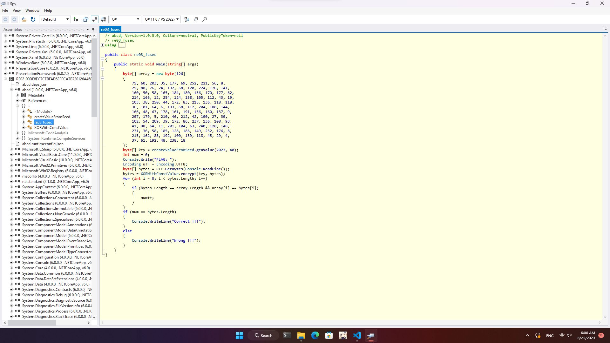

# RE02

Như 1 thói quen, bài này nhận đc file xong mình cũng vứt vào IDA. Nhưng sau khi xem qua thì thấy có vẻ file binary này là liên quan đến dotNET hoặc CLI gì đấy. Nên mình đổi sang dùng ILSpy để decompile, và mọi source code được hiện ra:



Đọc qua một lúc thì mình thấy bài này gen key ngẫu nhiên (nhưng cũng ko ngẫu nhiên lắm vì seed cố định :>) với độ dài 40 bytes. Sau đó cho nhập flag, lấy string sau khi nhập xor phần tử tương ứng với key vừa gen, sử dụng kết quả đó để so sánh với array được khai báo đầu hàm main. 

Okie, vậy là cách giải có ngay rồi. Mình chỉ cần lấy từng phần tử của array xor với key là ra flag.

Và đây là code C# mình dùng để giải bài này.

```CS
public static byte[] genValue(int your_choice, int length)
{
    Random random = new Random(your_choice);
    byte[] array = new byte[length];
    random.NextBytes(array);
    return array;
}

public static byte Create(byte x, byte y)
{
    return (byte)(x ^ y);
}

public static byte[] encrypt(byte[] key, byte[] inp)
{
    for (int i = 0; i < inp.Length; i++)
    {
        inp[i] = Create(inp[i], key[i % key.Length]);
    }
    return inp;
}

public static void Main(string[] args)
{
    byte[] array = new byte[126]
    {
        75, 60, 203, 35, 177, 69, 252, 221, 56, 8,
        25, 88, 76, 24, 192, 68, 120, 224, 176, 141,
        160, 50, 58, 165, 184, 180, 156, 170, 177, 62,
        214, 166, 12, 254, 124, 158, 105, 112, 43, 19,
        103, 38, 250, 44, 172, 83, 215, 136, 118, 118,
        36, 101, 64, 6, 193, 68, 112, 204, 188, 144,
        166, 48, 63, 178, 161, 191, 156, 160, 137, 9,
        207, 179, 5, 210, 46, 212, 42, 100, 27, 30,
        102, 54, 209, 39, 172, 86, 237, 136, 108, 93,
        41, 98, 64, 11, 201, 104, 63, 240, 128, 148,
        231, 36, 58, 185, 128, 186, 149, 232, 176, 8,
        215, 162, 88, 192, 100, 139, 118, 45, 29, 4,
        37, 61, 192, 48, 238, 18
    };
    byte[] key = genValue(2023, 40);
    int    num = 0;
    byte[] bytes = encrypt(key, array);
    for (int i = 0; i < bytes.Length; i++)
    {
        Console.Write((char)bytes[i]);
    }
}
```

và flag là: `FUSec{Congrat!!!_Here_is_their_blog_may_help_you_how_to_build_a_SingleFile_https://dotnetcoretutorials.com/single-file-apps-in-net-6}`