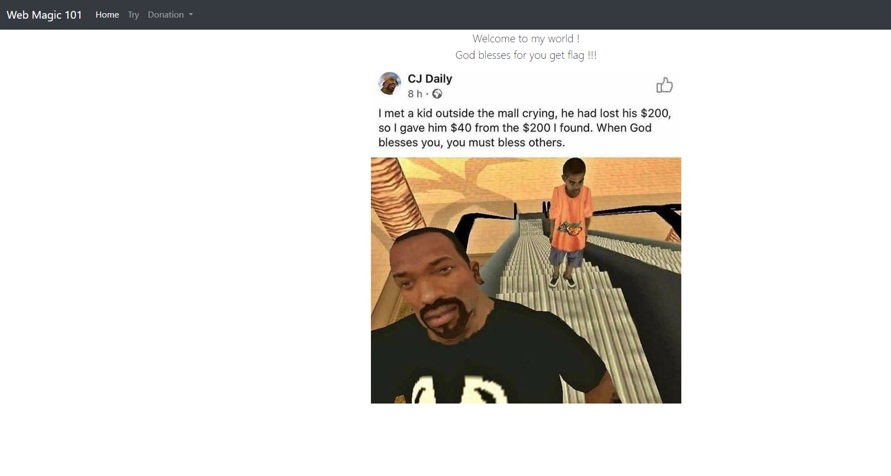
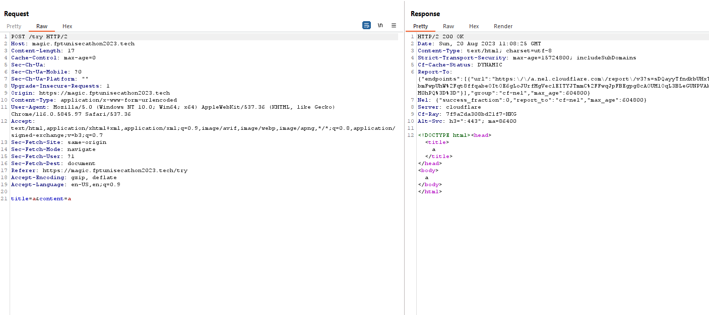
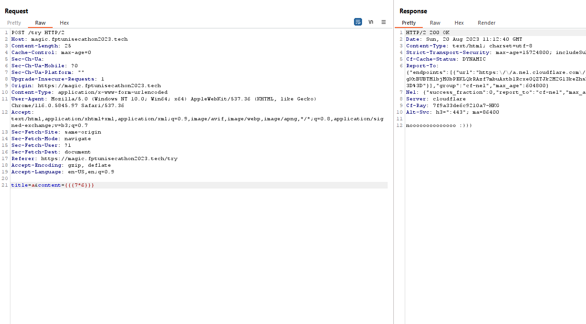
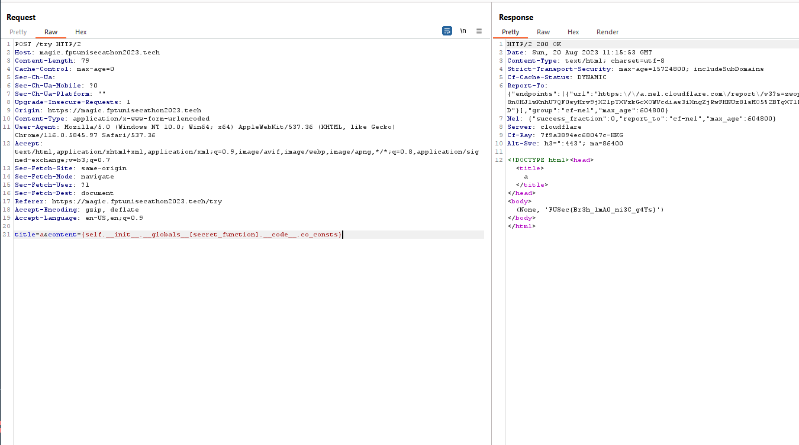

# Magic101
## Description
- Link challenge: https://magic.fptunisecathon2023.tech/
- Ảnh: 

## Solution
- Với mình, đây là 1 challenge khá guessing. Mình phải dùng tới hint đầu tiên "Lỗi string format của framework Flask và chú ý tới secret_function" để `search` ra được cách giải 😄.

- Website chỉ có duy nhất 1 endpoint `/try` với 2 parameter là `title` và `content`. Khi gửi về thì server sẽ render ra 1 trang web với title và content mình vừa gửi lên. Vậy nên ban đầu mình nghĩ tới việc khai thác SSTI để rce trên server.

- Tuy nhiên, sau khi thử 1 loại các payload thì đều trả về kết quả `noooooooo :))` hoặc không có kết quả gì cả (server filter 1 cặp {} - chỉ hiển thị nội dung phía trong). Với 1 bài blackbox, thì mình nghĩ bài này khá là guessing. Thậm chí, response trả về cũng không chứa bất kì thông tin gì của server để mình xác định ngôn ngữ backend của website.

- Tới đây, mình đã phải dùng tới hint, và chỉ 1 vài phút sử dụng search skill, mình đã tìm ra được 1 bài writeup về việc khai thác lỗi. Link writeup: https://ctftime.org/writeup/27904.

- Mình sẽ không phát minh lại bánh xe, nên mọi người tự đọc write up để biết thêm chi tiết 😘

- Payload cuối cùng: `{self.__init__.__globals__[secret_function].__code__.co_consts}`

- Flag: FUSec{Br3h_1mA0_ni3C_g4Ys}
